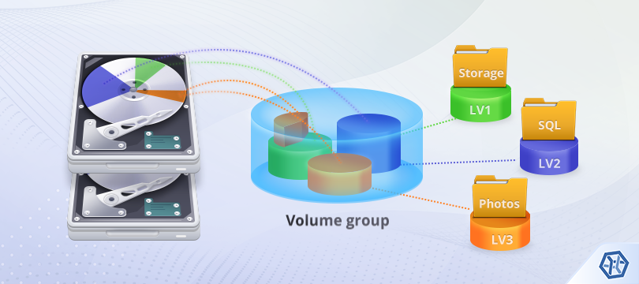

# LVM linux và khả năng phục hồi dữ liệu

# Mục lục
- [1. Khái niệm cơ bản LVM](#1)  
- [2. Tổ chức dữ liệu](#2)
- [3. Ưu nhược điểm ](#3)
- [4. Khả năng phục hồi dữ liệu](#4)

 

## 1. Khái niệm cơ bản LVM
Logical Volume Manager phục vụ một lớp trừu tượng giữa hệ điều hành và các đĩa vật lý. Các thiết bị lưu trữ được đại diện bởi một hoặc một số phân vùng.  

Cấu trúc LVM bao gồm :

- Physical volumes. là phân vùng đĩa thông thường hoặc toàn bộ thiết bị lưu trữ như ổ đĩa cứng bên trong hoặc bên ngoài, hệ thống RAID dựa trên phần mềm hoặc phần cứng, v.v.

- Volume groups.  Nhiều Physical Volume trên những ổ đĩa khác nhau được kết hợp lại thành một Volume Group .Khi một volume group được tạo,nó sẽ tự động được chia thành các khối lưu trữ có cùng kích thước cố định được gọi là phạm vi vật lý.

- Physical extents. Một phạm vi vật lý là khối nhỏ nhất mà logical volume được phân tách (kích thước mặc định là 4 MiB).

- Logical volumes. là một phần của một nhóm âm lượng và bao gồm các phạm vi vật lý.  

  

## 2. Tổ chức dữ liệu

Để tổ chức và theo dõi các cấu trúc bên trong của nó, LVM sử dụng nhãn physical volume labels và metadata.  

- Nhãn Physical volume chứa UUID (mã định danh duy nhất toàn cầu) của volume group tương ứng, kích thước của nó tính bằng byte, danh sách vùng dữ liệu và vị trí vùng metadata.

- Metadata được lưu trữ trong ASCII và chứa tất cả các chi tiết cấu hình của từng volume group.Metadata mới thường được thêm vào cuối metadata cũ và sau đó con trỏ tới metadata bắt đầu được cập nhật.

Metadata bao gồm :

- Danh sách các physical volumes mà nó bao gồm cùng với các UUID, thuộc tính, số lượng phạm vi và phần bù của chúng bắt đầu ở mức độ đầu tiên trong các lĩnh vực.
- Danh sách các logical volumes, mỗi mục trong đó bao gồm một danh sách các phân đoạn logical volume, ánh xạ tới danh sách các phân đoạn khối vật lý.   

## 3. Ưu nhược điểm 
### Thay đổi kích thước của volume
- Thay vì thiết lập các phân vùng có kích thước cố định ngay từ đầu, người dùng có thể để lại không gian lưu trữ không liên kết và sau đó thêm nó vào một phân vùng được gắn nhất định khi nó được lấp đầy. Không cần sao lưu tất cả dữ liệu và định dạng lại bộ lưu trữ.
### Mở rộng công suất 
- Bất kỳ số lượng thiết bị lưu trữ vật lý hợp lệ ở bất kỳ kích thước nào đều có thể được thêm vào một volume group để mở rộng dung lượng.  
### Thin Provisioning
- Một thin pool có thể được tạo trong một volme group, sẽ cung cấp chỗ cho tất cả các logical volume ràng buộc với nó.
- Mỗi thin volumes được gán một kích thước ảo có thể vượt quá dung lượng trống trên bộ lưu trữ vật lý.
### Hỗ trợ snapshots 
- LVM hỗ trợ snapshots cho phép tạo bản sao dự phòng của hệ thống tệp tại một thời điểm nhất định.  
### Giảm volume không an toàn
- Giảm kích thước của một logical volume hoặc không gian lưu trữ được phân bổ lại dẫn đến mất dữ liệu.
### Không khởi động kép
- Đối với môi trường khởi động kép, phân vùng không phải LVM tiêu chuẩn sẽ được tạo.
### Rủi ro khi ghi đè
- Bằng cách đa khởi động, các hệ điều hành khác có thể không phát hiện được trình quản lý volume và xem xét đĩa trống có khả năng ghi đè không.
###  Không có khả năng chịu lỗi
- Việc mất hoặc xóa đĩa khỏi LVM sẽ khiến toàn bộ bộ nhớ cùng với tất cả các tệp không thể truy cập được trong khi xác suất xảy ra lỗi như vậy tăng theo mỗi đĩa được thêm vào.  
### Khả năng xảy ra rủi ro metadata
- Tuy nhiên, bất kỳ sự gián đoạn nào có thể xảy ra của quy trình này do mất điện, sự cố phần mềm hoặc phần cứng hoặc lỗi người dùng đơn giản có thể ngăn chặn metadata chính xác được ghi hoàn toàn và khiến toàn bộ bộ nhớ không thể sử dụng được.

## 4. Khả năng phục hồi dữ liệu 
- Bộ nhớ ảo sẽ được thêm vào danh sách các kho lưu trữ được kết nối trong bảng điều khiển bên trái của tab chính để phục hồi dữ liệu hơn nữa. 
- Khi server bị hư hỏng hoặc việc ghi đè lên LVM metadata sẽ rất khó cho việc phục hồi dữ liệu.Khi có nhiều physical volumes trong cùng một volume group.
- Trong một số trường hợp metadata có thể phục hồi dữ liệu nhờ bản sao lưu được lưu trữ trong /etc/lvm/backup.
