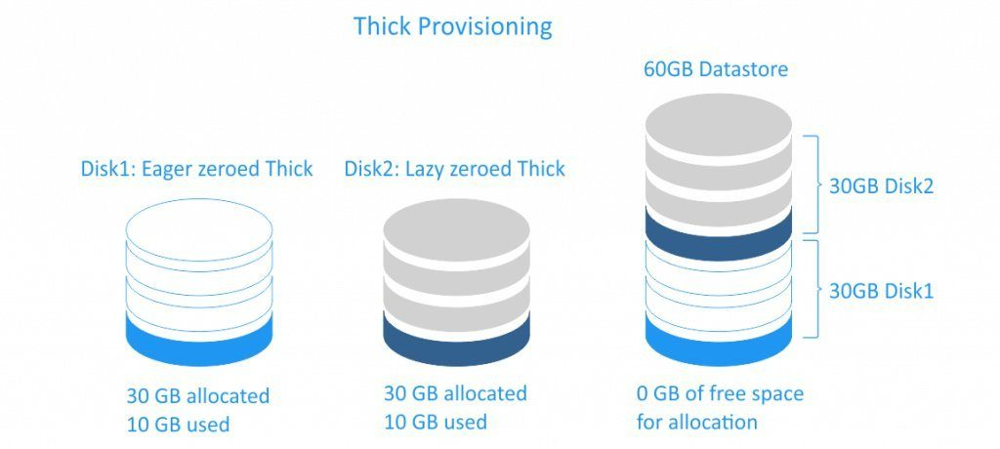

# Thick and Thin Provisioning 

## 1. Thick Provisioning

- Thick Provisioning là một loại phân bổ lưu trữ trước.
- Khi ta tạo một disk ảo cho máy ảo nó sẽ nhận nguyên dung lượng disk đó làm disk của nó dù cho nó chưa sử dụng hết dung lượng disk đó.     

Giả sử bạn tạo VM 100Gb, Chọn định dạng Thick thì VM sẽ chiếm dụng đúng 100Gb của server, chọn Thin thì VM chỉ chiếm dụng đúng dung lượng mà nó đang lưu trữ.  

Thick có 2 loại là:

- Thick Lazy là Nó nhận đủ dung lượng disk mà ta tạo cho máy ảo và nó sẽ không xóa dữ liệu cũ trên disk. khi chúng ta ghi cái ghì lên đó thì nó mới xóa dữ liệu đó đi. Chính vì vậy nên việc tạo đĩa ảo sẽ rất nhanh nhưng sẽ mất nhiều thời gian cho lần ghi đầu tiên do phải xóa dữ liệu cũ.
- Thick Eager là cũng nhận toàn bộ dung lượng mà ta tạo disk cho VM và không gian bị xóa sạch mọi dữ liệu trước đó trên phương tiện vật lý.Vì vậy khi tạo disk cho VM ở kiểu này sẽ lâu hơn so với thick lazy nhưng với lần ghi đầu tiên sẽ nhanh hơn.  
- Như vậy dung lượng bị lãng phí là rất lớn. Nhưng nó sẽ đảm bảo sự độc lập giữa các máy ảo.

## 2. Thin Provisioning

- Thin là một loại chia ra trước lưu trữ. nó chỉ tiêu thụ dung lượng mà nó cần ban đầu và cấp phát theo sự phát triển
- Với cơ chế này sẽ tránh được sự lạng phí dung lượng ổ cứng so với thick. Cơ chế này thì máy ảo chỉ chiếm dung lượng bằng đúng phần dung lượng mà nó đang lưu trữ. Vì vậy với phần dung lượng còn trống ta vẫn có thể làm việc khác
- Với cơ chế này ta có thể tận dụng được hết dung lượng disk nhưng nó có nhược điểm là nếu dung lượng đĩa cứng bị hết thì tất cả các VM trên đó sẽ gặp vấn đề vì không còn dung lượng disk để sử dụng.

