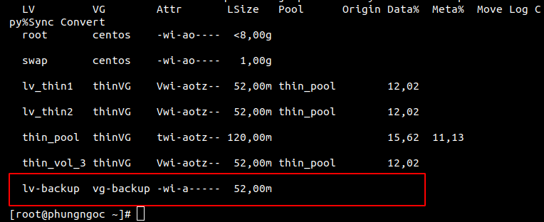

# Tìm hiểu về LVM backup và snapshot
# Mục lục 
[I.LVM Backup](#I)
- [1.vgcfgbackup](#1)
- [2.vgcfgrestore](#2)
- [3.Cách tạo và sử dụng LVM backup](#3)

[II.LVM Snapshot](#II)
- [1.Snapshot là gì?](#12)
- [2. Cách tạo ra một snapshot](#22)
- [3 Cách sử dụng Snapshot](#23)

<a name="I"></a>

## I.LVM Backup

<a name="1"></a>

### 1.vgcfgbackup

Bất cứ khi nào bạn thực hiện bất kỳ hoạt động lvm nào như lvcreate, loại bỏ, thêm đĩa ... nên được cập nhật trong tệp conf nhóm khối tương ứng trong thư mục /etc/lvm/. Nếu đĩa bị lỗi, chúng tôi có thể khôi phục cấu hình LVM vào đĩa bằng tệp cấu hình sao lưu này. Lệnh vgcfgbackup lấy dữ liệu cấu hình từ tiêu đề lvm của đĩa và lưu vào một vị trí tệp mặc định /etc/lvm/backup/vg_name. 

```
vgcfgbackup [-f path_newfilename ] vg_name  
```
Trong đó :

- vg_name : Tên của volume group
- -f : chỉ định nơi lưu trữ file backup , nếu không có thì mặc định lưu tại /etc/lvm/backup/

Chúng ta hãy xem thư mục sao lưu: 

```
 ls -l /etc/lvm/backup/
```

<a name="2"></a>

## 2.vgcfgrestore 
Lệnh `vgcfgrestore` khôi phục LVM volume group từ các Physical Volume.  
Câu lệnh:
```
vgcfgrestore [-f|--file <filename>] [-v] vg_name  
```
Trong đó:
- vg_name : Tên volume group .
- -f : Đường dẫn lưu file backup .
- -v : để biết chi tiết về những gì đang xảy ra.

<a name="3"></a>

## 3.Cách tạo và sử dụng LVM backup
 
### Chuẩn bị:  
Tạo 1 vg-backup và 1 lv-backup



### Backup 
```
vgcfgbackup [-f path_newfilename ] vg_name
```

