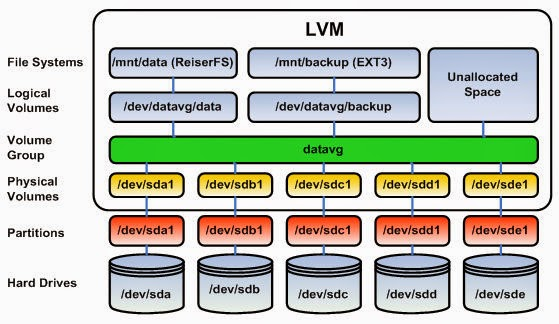
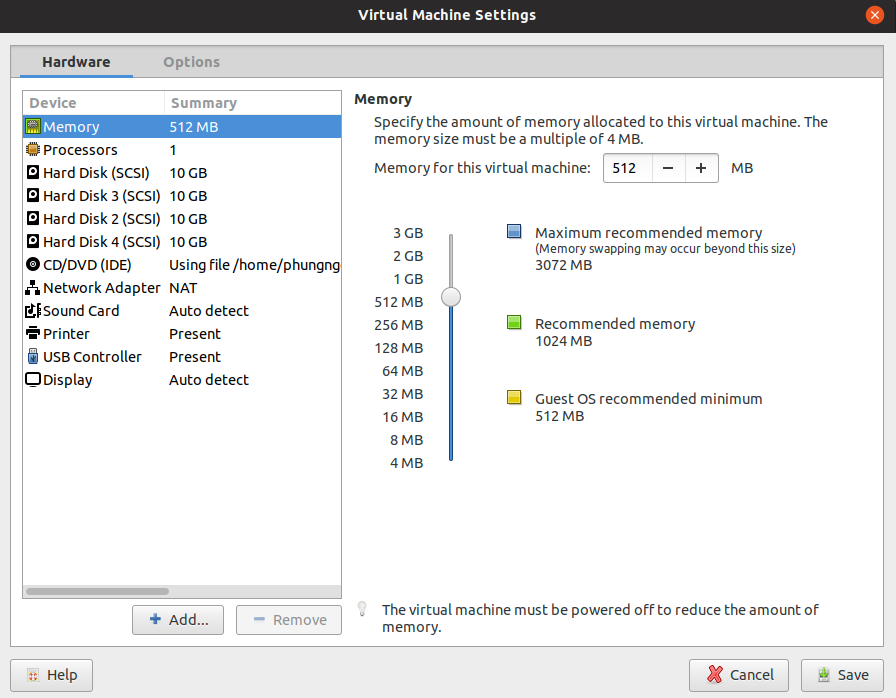
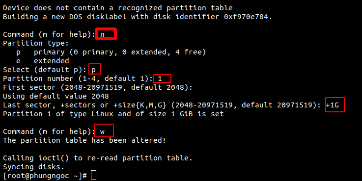
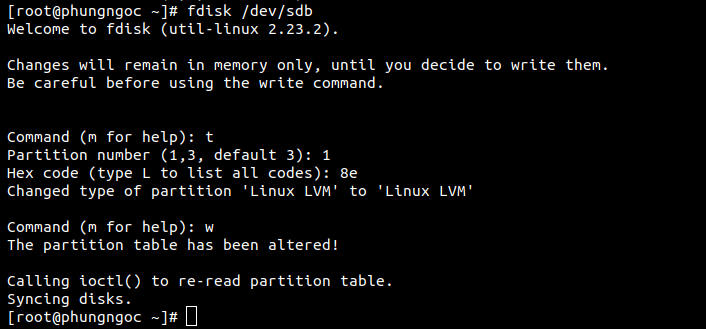
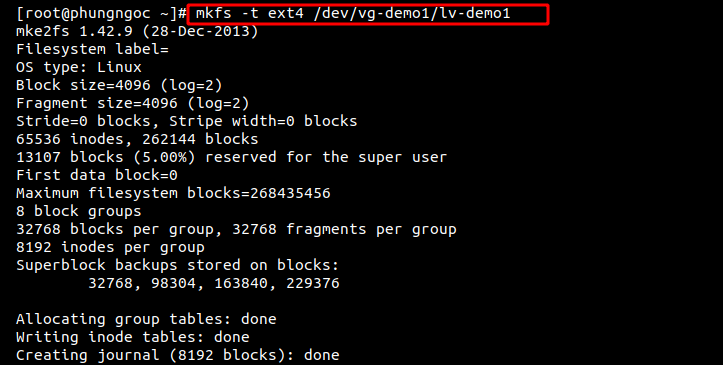
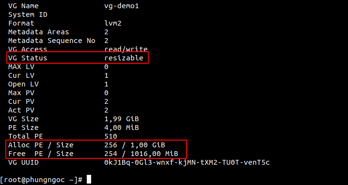
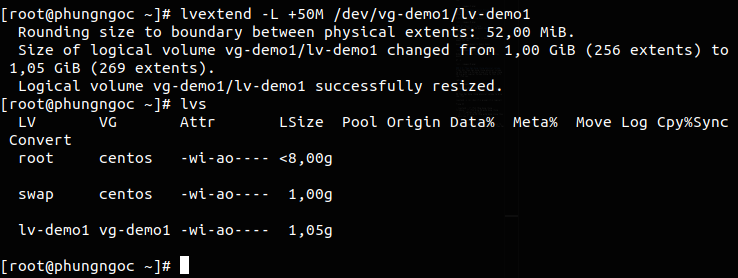

# Mục lục

- [1.Giới thiệu LVM](#1)    
- [2.Ưu nhược điểm LVM](#2)  
- [3.Các thành phần trong LVM](#3)  
- [4.Thao tác với LVM](#4)  
- [4.1.Chuẩn bị](#4.1)    
- [4.2.Tạo Logical Volume trên LVM](#4.2)     
- [4.3.Thay đổi dung lượng physical volume](#4.3)   
- [4.4.Thay đổi dung lượng volume group](#4.4)
- [4.5.Xóa Logical Volume, Volume Group, Physical Volume](#4.5)  


# Giới thiệu về LVM (Logical Volume Management)

<a name="1"></a>

## 1. Giới thiệu LVM 
Logical Volume Management(LVM) dùng quản lí các thiết bị lưu trữ. Là một phương pháp ấn định không gian ổ đĩa thành những logicalvolume khiến cho việc thay đổi kích thước của một phân vùng trở nên dễ dàng. Điều này thật dễ dàng khi bạn muốn quản lý công việc của mình tại riêng một phân vùng mà muốn mở rộng nó ra lớn hơn.

<a name="2"></a>

## 2. Ưu nhược điểm của LVM

Ưu điểm của LVM là tăng tính linh hoạt và khả năng kiểm soát.
- Không để hệ thống bị gián đoạn hoạt động
- Không làm hỏng dịch vụ
- Có thể kết hợp Hot Swapping (thao tác thay thế nóng các thành phần bên trong máy tính)

Nhược điểm:
- Các bước thiết lập phức tạp và khó khăn hơn
- Càng gắn nhiều đĩa cứng và thiết lập càng nhiều LVM thì hệ thống khởi động càng lâu.
- Khả năng mất dữ liệu cao khi một trong số các đĩa cứng bị hỏng.
- Windows không thể nhận ra vùng dữ liệu của LVM. Nếu Dual-boot ,Windows sẽ không thể truy cập dữ liệu trong LVM.

<a name="3"></a>

## 3. Thành phần trong LVM

 

### Hard drives – Drives
Thiết bị lưu trữ dữ liệu.
### Partitions 
Là các phân vùng của Hard drives, mỗi Hard drives có 4 partition, trong đó partition bao gồm 2 loại là primary partition và extended partition  

Primary partition:
- Phân vùng chính, có thể khởi động
Mỗi đĩa cứng có thể có tối đa 4 phân vùng này

Extended partition:
- Phân vùng mở rộng, có thể tạo những vùng luân lý
### Physical Volumes

Là một cách gọi khác của partition trong kỹ thuật LVM, nó là những thành phần cơ bản được sử dụng bởi LVM. Một Physical Volume không thể mở rộng ra ngoài phạm vi một ổ đĩa.  

### Volume Group

Nhiều Physical Volume trên những ổ đĩa khác nhau được kết hợp lại thành một Volume Group

### Logical volume 
Volume Group được chia nhỏ thành nhiều Logical Volume, mỗi Logical Volume có ý nghĩa tương tự như partition. Nó được dùng cho các mount point và được format với những định dạng khác nhau như ext2, ext3, ext4,…
### File Systems

- Tổ chức và kiểm soát các tập tin  
- Được lưu trữ trên ổ đĩa cho phép truy cập nhanh chóng và an toàn  
- Sắp xếp dữ liệu trên đĩa cứng máy tính  
- Quản lý vị trí vật lý của mọi thành phần dữ liệu

<a name="4"></a>

## 4. Thao tác với LVM

<a name="4.1"></a>

### 4.1. Chuẩn bị
Tạo máy ảo trên vmware Workstation cài CentOS7
Add thêm một số ổ cứng vào máy ảo



<a name="4.2"></a>

### 4.2. Tạo Logical Volume trên LVM
#### B1. Kiểm tra các Hard Drives có trên hệ thống

Bạn có thể kiểm tra xem có những Hard Drives nào trên hệ thống bằng cách sử dụng câu lệnh lsblk 

```
 lsblk
```


Trong đó các sdb, sdc, sdd là các hard disks thêm vào.    


#### B2. Tạo Partition
Ở đây, từ sdb, mình tạo các partition bằng cách sử dụng lệnh sau :
```
fdisk /dev/sdb 
```
 

Tiếp theo bạn thay đổi định dạng của partition vừa mới tạo thành LVM:



#### B3. Tạo Physical Volume
Ta sử dụng lệnh pvcreate theo cú pháp :
```
pvcreate /dev/(tên phân vùng)
```
Tạo các Physical Volume là /dev/sdb1:
```
pvcreate /dev/sdb1
```
Ta dùng lệnh 'pvs' để kiểm tra các Physical Volume.


#### B4. Tạo Volume Group

Ta sử dụng lệnh vgcreate theo cú pháp:
```
vgcreate (ten_group) /dev/(tên phân vùng 1) /dev/(tên phân vùng 2)
```
Ta dùng lệnh 'vgs' để kiểm tra các Volume Group


#### B5. Tạo Logical Volume
```
lvcreate -L size_volume -n (ten logical) (tên group volume)
```
-L: Chỉ ra dung lượng của logical volume

-n: Chỉ ra tên của logical volume

Có thể sử dụng câu lệnh sau để kiểm tra lại các Logical Volume đã tạo
```
lvs
```

  

#### B6. Định dạng Logical Volume
Để format các Logical Volume thành các định dạng như xfs,ext3, ext4, ta có thể làm như sau:
```
mkfs -t ext4 /dev/vg-demo1/lv-demo1
```


#### B7. Mount và sử dụng
Ta cần tạo thư mục để mount Local Volume vào thư mục đó.
```
mkdir demo1
```
Ta mount logical volume `lv-demo1` vào thư mục demo1 như sau:
```
mount /dev/vg-demo1/lv-demo1 demo1
```


Kiểm tra lại dung lượng của thư mục đã được mount:
```
df -h
```


<a name="4.3"></a>

### 4.3. Thay đổi dung lượng physical volume
Trước khi thay đổi dung lượng physical volume ta cần kiểm tra Volume Group còn dư dung lượng để kéo giãn Logical Volume không ta thực hiện câu lệnh sau:
```
vgdisplay
```


Ta dựa vào các thông số  `VG Status resizable` 
và `Free  PE / Size       254 / 1016,00 MiB`

Để thay đổi dung lượng physical volume ta dùng câu lệnh :
```
lvextend -L (n) /dev/(tên group)/(tên logical)
```
Trong đó

- lvextend : là lệnh tăng dung lượng
lvreduce : là lệnh dùng để giảm dung lượng
- -L : là option của lệnh
- (n) : là số dùng để tăng giảm dung lượng theo ý muốn của t  



Sau khi ta thay đổi dung lượng như ta muốn thì ta sử dụng lệnh `resize2fs` để xác nhận thay đổi
```
resize2fs /dev/(ten_group)/(ten_logical)
```


Để giảm kích thước của Logical Volume, trước hết các bạn phải umount Logical Volume mà mình muốn giảm:
```
umount /dev/(ten_group)/(ten_logical)
```
Tiến hành giảm kích thước của Logical Volume:
```
lvreduce -L 20M /dev/(ten_group)/(ten_logical)
```


Cuối cùng là mount lại Logical Volume
```
 mount /dev/(ten_group)/(ten_logical) (ten_thu_muc)
```


<a name="4.4"></a>

### 4.4. Thay đổi dung lượng volume group 
Đầu tiên ta kiểm tra xem có phân vùng nào chưa thuộc group thì ta sẽ thêm phân vùng đó vào một group là cách để tăng kích thước cho group đó.  

Nhóm thêm 1 partition vào Volume Group như sau:
```
vgextend /dev/vg-demo1 /dev/sdb3
```
 

Chúng ta có thể cắt 1 Physical Volume ra khỏi Volume Group như sau:

```
vgreduce /dev/vg-demo1 /dev/sdb3
```


<a name="4.5"></a>

### 4.5. Xóa Logical Volume, Volume Group, Physical Volume
#### Xóa Logical Voulume
Trước tiên ta phải Umount Logical Volume
```
 umount /dev/vg-demo1/lv-demo1
```

Sau đó tiến hành xóa Logical Volume bằng câu lệnh sau:
```
lvremove /dev/vg-demo1/lv-demo1
```
#### Xóa Volume Group

Trước khi xóa Volume Group, chúng ta phải xóa Logical Volume

Xóa Volume Group bằng cách sử dụng lệnh sau:
```
vgremove /dev/vg-demo1
```
#### Xóa Physical Volume

Cuối cùng là xóa Physical Volume:
```
pvremove /dev/sdb3
```
Để xóa một phân vùng của một thiết bị nào nào đó ta dùng lệnh fdisk tên_thiết_bị sau đó chọn d và cuối cùng là chọn tên của phân vùng muốn xóa. 


