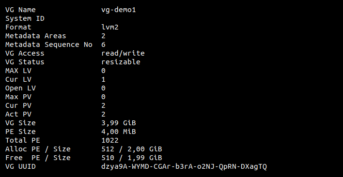
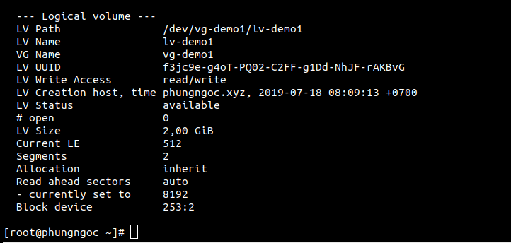

# Ý nghĩa các lệnh vgdisplay, lvdisplay, lvs, vgs

Ta chạy lệnh `vgdisplay` :

 

Ý nghĩa các thông tin của Volume group khi chạy lệnh vgdisplay:

- `VG Name`  : Tên Volume Group.
- `Format`   : Kiến trúc LVM được sử dụng.
- `VG Access`: Volume Group có thể đọc và viết và sẵn sàng để sử dụng.
- `VG Status`: Volume Group có thể được định cỡ lại, chúng ta có thể mở rộng thêm nếu cần thêm dung lượng.
- `PE Size`  : Mở rộng Physical, Kích thước cho đĩa có thể được xác định bằng kích thước PE hoặc GB, 4MB là kích thước PE mặc định của LVM
- `Total PE` : Dung lượng Volume Group có
- `Alloc PE` : Tổng PE đã sử dụng
- `Free PE`  : Tổng PE chưa được sử dụng

Sử dụng lệnh sau để hiển thị thông tin chi tiết của các logical volume:
```
lvdisplay
```

 

Ý nghĩa các trường của lvdisplay:

- LV Path : thư mục chứa Logical Volume
- LV Name : tên của Logical Volume
- VG Name : tên của Volume Group mà Logical Volume thuộc vào.
- LV UUID : Universally Unique IDentifier
- LV Write Access : Logical Volume ghi truy cập 
- LV Creation host, time : thời gian 
- LV Status : Trạng thái Logical Volume
- LV Size : Dung lượng Logical Volume
- Currents LE: 
- Segments : 
- Allocation :inherit
- Read ahead sectors:
- currently set to:
- Block device : 

Kiểm tra dung lượng của Logical Volume và kiểm tra file system:

 

Ý nghĩa các trường của lvs:

- LV: Tên logical volume
- %Data: Phần trăm dung lượng logical volume được sử dụng
- Lsize: Kích thước của logical volume 

  


