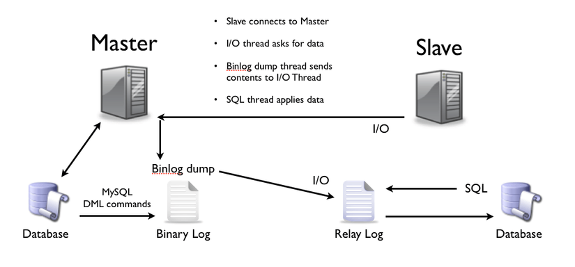

# MariaDB Master-Slave Replication
# Mục lục 
[1. Khái niệm MySQL Replication](#1)  
[2. Ưu điểm của Replication](#2)  
[3. Cách thức hoạt động](#3)

## 1. Khái niệm MariaDB Replication
-  MySQL Replication một quá trình cho phép bạn dễ dàng duy trì nhiều bản sao của dữ liệu MySQL
bằng cách cho họ sao chép tự động từ một master tạo ra một cơ sở dữ liệu slave. 
- Replication có ý nghĩa là “nhân bản”, là có một phiên bản giống hệt phiên bản đang tồn tại, đang sử dụng.
- Server master lưu trữ phiên bản cơ sở dữ liệu phục vụ ứng dụng. Server slave lưu trữ phiên bản cơ sở dữ liệu “nhân bản”. Quá trình nhân bản từ master sang slave gọi là replication.

## 2. Ưu điểm của replication trong mysql

- Giảm tải cho cơ sở dữ liệu server master, tải trọng của server được phân tải cho các con slave, cải thiện hiệu năng cho toàn hệ thống.
- Tính bảo mật dữ liệu cao - vì dữ liệu được sao chép đến các slave, và các slave có thể tạm dừng quá trình sao chép, nó có thể chạy các dịch vụ sao lưu trên các slave mà không làm hư hỏng dữ liệu tổng thể tương ứng.
- Tính phân phối dữ liệu từ xa - bạn có thể sử dụng replication để tạo ra một bản sao của dữ liệu cho một trang web từ xa để sử dụng, mà không cần truy cập thường xuyên vào con master.

## 3. Cách thức hoạt động

### Mô hình 

 

- Tại thời điểm hoạt động bình thường mọi request sẽ được đưa đến vào MySQL master. Khi MySQL master gặp sự cố, request sẽ được đẩy qua cho MySQL slave xử lí. Khi MySQL master up lại bình thường, request sẽ được trả về cho MySQL master.

