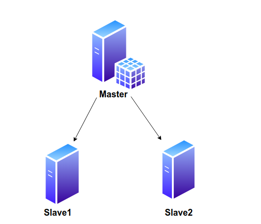
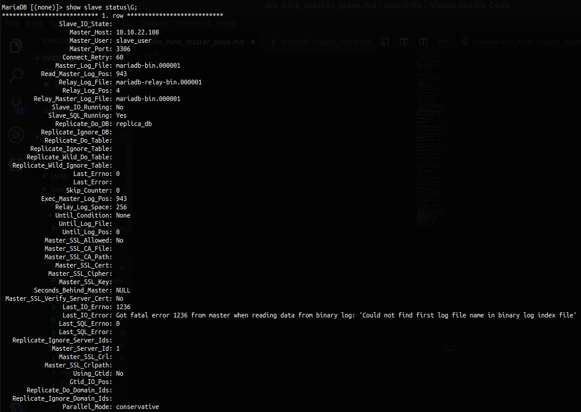
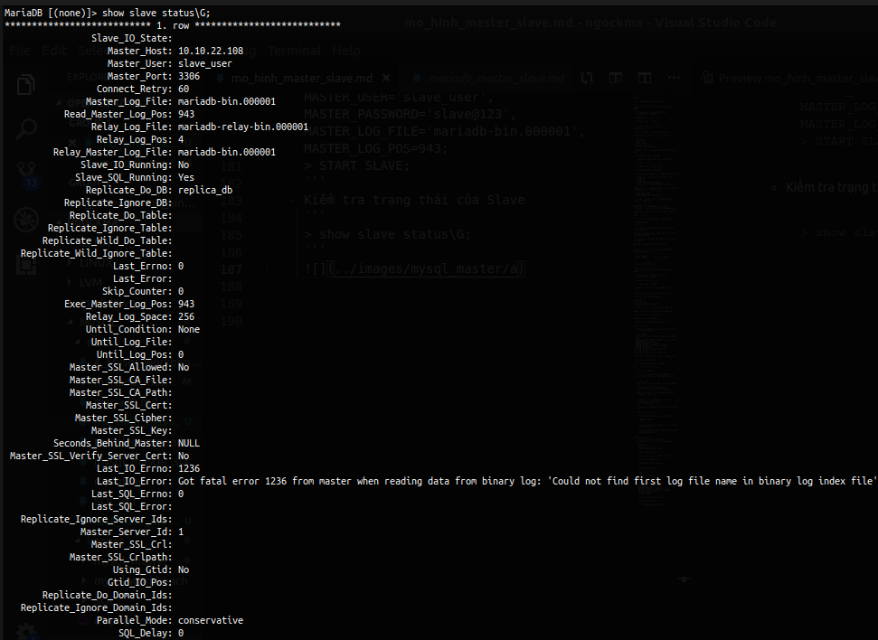
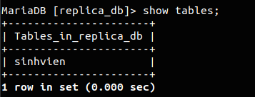

# MariaDB Replication 1 master và 2 slaves
# Mục lục 

[1. Cấu hình trên Master](#1)    
[2. Cấu hình trên Slave1](#2)  
[3. Cấu hình trên Slave1](#3)  
[4. Kiểm tra](#4)
## Mô hình



<a name="1"></a>

## 1. Cấu hình trên Master
- Cấu hình firewall, cho phép lắng nghe port 3306
```
  # firewall-cmd --add-port=3306/tcp --zone=public --permanent
```
- Reload xác nhận cấu hình
```
  # firewall-cmd --reload
```

- Chỉnh sửa file /etc/my.cnf.d/mariadb-server.cnf
```
  # vi  /etc/my.cnf.d/mariadb-server.cnf
```
Trong phần [mariadb] thêm các dòng sau:
```
  [mariadb]
  server-id=1
  log-bin=master
  binlog-format=row
  binlog-do-db=replica_db
```
- Restart lại dịch vụ mariadb để nhận cấu hình mới
```
  # systemctl restart mariadb
```
- Sử dụng root user đăng nhập vào MariaDB
```
  # mysql -u root -p
```
- Tạo CSDL có tên là replica_db
```
  > create database replica_db;
```
- Tạo Slave user, password và gán quyền cho user
```
 > create user 'slave_user'@'%' identified by 'slave@123';
  > stop slave;
  > GRANT REPLICATION SLAVE ON *.* TO 'slave_user'@'%' IDENTIFIED BY 'slave@123';
```
- Ngăn chặn mọi thay đổi đối với dữ liệu trong khi bạn xem vị trí binary log:
```
> FLUSH PRIVILEGES; 
> FLUSH TABLES WITH READ LOCK;
```
- Sao lưu cơ sở dữ liệu trong máy chủ Master và chuyển nó sang Slave

```
mysqldump --all-databases --user=root --password --master-data > masterdatabase.sql
```
Đăng nhập vào MySQL với tư cách người dùng root:
```
mysql -u root -p
```
- Và thực hiện unlock tables , sau đó thoát:
```
> UNLOCK TABLES;
> exit;
```
- Sao chép tệp masterdatabase.sql vào máy chủ Slave của bạn.
```
scp masterdatabase.sql root@10.10.22.107:/root/masterdatabase.sql
```
- Sử dụng câu lệnh dưới để kiểm tra trạng thái của Master
```
MariaDB [(none)]> show master status;
+---------------+----------+--------------+------------------+
| File          | Position | Binlog_Do_DB | Binlog_Ignore_DB |
+---------------+----------+--------------+------------------+
| master.000001 |      943 | replica_db   |                  |
+---------------+----------+--------------+------------------+
1 row in set (0.000 sec)
```

<a name="2"></a>

## 2. Cấu hình trên Slave1 
- Cấu hình firewall, cho phép lắng nghe port 3306
```
  # firewall-cmd --add-port=3306/tcp --zone=public --permanent
```
- Reload xác nhận cấu hình
```
  # firewall-cmd --reload
```
- Chỉnh sửa /etc/my.cnf.d/mariadb-server.cnf file
```
  # vi /etc/my.cnf.d/mariadb-server.cnf
```
- Sau đó thêm vào các dòng sau
```
[mariadb]
server-id = 2
replicate-do-db=replica_db
``` 
-  Nhập cơ sở dữ liệu chủ như được hiển thị
```
mysql -u root -p < /root/masterdatabase.sql 
```
- Sau đó restart lại mariadb:
```
systemctl restart mariadb
```
- Login vào MariaDB bằng tài khoản root :
```
mysql -u root -p
```
- Stop Slave. Hướng dẫn Slave tìm `Master log file` và start Slave 
```
  > STOP SLAVE;
  Query OK, 0 rows affected, 1 warning (0.000 sec)
  >CHANGE MASTER TO MASTER_HOST='10.10.22.108', MASTER_USER='slave_user', MASTER_PASSWORD='slave@123', MASTER_LOG_FILE='master.000001', MASTER_LOG_POS=943;
Query OK, 0 rows affected (0.010 sec)
  > START SLAVE;
Query OK, 0 rows affected (0.003 sec)
```
- Kiểm tra trạng thái của Slave, sử dụng lệnh:
```
  > show slave status\G;
```


<a name="3"></a>

## 3. Thêm Slave vào hệ thống

- Cấu hình trên Master

  - Bật tính năng read only để không ghi thêm dữ liệu mới vào CSDL và tắt replication:

    ```
    > stop slave;
    Query OK, 0 rows affected, 1 warning (0.000 sec)
    > flush table with read lock;  
    Query OK, 0 rows affected (0.002 sec)
    ```
  - Sao lưu cơ sở dữ liệu trong máy chủ Master và chuyển nó sang Slave

    ```
    mysqldump --all-databases --user=root --password --master-data > masterdatabase.sql
    ```
   - Đăng nhập vào MySQL với tư cách người dùng root:
     ```
     mysql -u root -p
     ```
- Và thực hiện unlock tables , sau đó thoát:
     ```
     > UNLOCK TABLES;
     > exit;
     ```
    - Sao chép tệp `masterdatabase.sql` vào máy chủ Slave của bạn.
     ```
      scp masterdatabase.sql root@10.10.22.106:/root/masterdatabase.sql
     ```

- Cấu hình Slave 2
   - Chỉnh sửa file /etc/my.cnf.d/mariadb-server.cnf và thêm vào dòng sau:
     ```
     [mariadb]
     server-id = 3
     replicate-do-db=replica_db
     ```
   - Import CSDL master
     ```
     # mysql -u root -p < /root/masterdatabase.sql

     ```
   - Restart MariaDB service
     ```
     # systemctl restart mariadb
     ```

   - Đăng nhập vào Mariadb
     ```
     mysql -u root -p
     ```
   - Stop Slave. Hướng dẫn Slave tìm `Master log file` và start Slave 
     ```
     > STOP SLAVE;
     >CHANGE MASTER TO MASTER_HOST='10.10.22.108', MASTER_USER='slave_user', MASTER_PASSWORD='slave@123', MASTER_LOG_FILE='master.000001', MASTER_LOG_POS=943;
     > START SLAVE;
     ```
   - Kiểm tra trạng thái của Slave
     ```
     > show slave status\G;
     ```

         

<a name="4"></a>

## 4. Kiểm tra
- Bên Master: 
   - Tạo table trong Database, insert dữ liệu vào table

    

    

- Bên Slave1:
   
    

- Bên Slave2:

   


