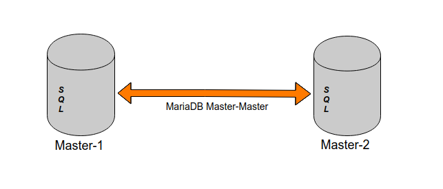
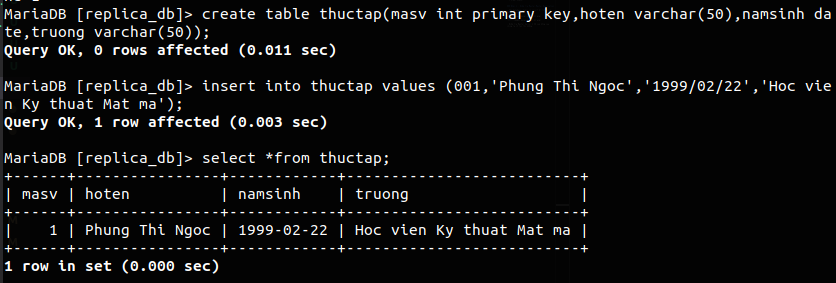

# Cấu hình MariaDB Master-Master Replication 

## Mô hình 




## Bước 1: Cài đặt MariaDB trên cả 2 Master Server
```
  # yum install -y mariadb-server
  # systemctl enable mariadb
  # systemctl start mariadb
```
### Bước 2: Thiết lập mật khẩu cho 2 Master 
```
  # mysql_secure_installation
```
### Bước 3: Cấu hình cơ sở dữ liệu Master Server 1
- Cho phép cổng 3306 của MariaDB trên tường lửa CentOS 8. 
Để thực hiện điều này, hãy chạy các lệnh :
```
# firewall-cmd --add-port=3306/tcp --zone=public --permanent
```
- Reload tường lửa để thực hiện các thay đổi:
```
# firewall-cmd --reload
```

- Chỉnh sửa file sau:
```
vi /etc/my.cnf.d/mariadb-server.cnf 
``` 
- Chúng ta thực hiện một vài thay đổi như sau:

```
[mariadb]
server_id=1
log-bin=master
binlog-format=row
binlog-do-db=replica_db
```
- Tiếp theo, khởi động lại dịch vụ MariaDB bằng lệnh: 
```
systemctl restart mariadb
```
- Đăng nhập vào MariaDB với tư cách là người dùng root:
```
mysql -u root -p
```
- Chúng ta cần tạo user được sử dụng để sao chép dữ liệu giữa hai VPS.
```
> CREATE USER 'master1'@'%' IDENTIFIED BY 'master@123';
```
- Cấp quyền cho user:
```
> GRANT REPLICATION SLAVE ON *.* TO 'master1'@'%' IDENTIFIED BY 'master@123';
```
- Ngăn chặn mọi thay đổi đối với dữ liệu trong khi bạn xem vị trí binary log:
```
> FLUSH PRIVILEGES; 
> FLUSH TABLES WITH READ LOCK;
```
- Trạng thái master:
```
>show master status;
```


### Bước 4: Cấu hình cơ sở dữ liệu Master Server 2

- Chỉnh sửa file /etc/my.cnf.d/mariadb-server.cnf
```
  # vi  /etc/my.cnf.d/mariadb-server.cnf
```
Trong phần [mariadb] thêm các dòng sau:
```
  [mariadb]
  server-id=2
  log-bin=master
  binlog-format=row
  binlog-do-db=replica_db
```
- Restart lại dịch vụ mariadb để nhận cấu hình mới
```
  # systemctl restart mariadb
```
- Sử dụng root user đăng nhập vào MariaDB
```
  # mysql -u root -p
```
- Tạo Slave user, password và gán quyền cho user
```
 > create user 'slave_user'@'%' identified by 'slave@123';
  > stop slave;
  > GRANT REPLICATION SLAVE ON *.* TO 'master1'@'%' IDENTIFIED BY 'master@123';
```

- Stop Slave. Hướng dẫn Slave tìm `Master log file` và start Slave 
```
  > STOP SLAVE;
  >CHANGE MASTER TO MASTER_HOST='10.10.22.108', MASTER_USER='master1', MASTER_PASSWORD='master@123', MASTER_LOG_FILE='master.000005', MASTER_LOG_POS=1208;
  > START SLAVE;
```
- Trạng thái master 2:
```
>show master status;
```
 

### Bước 5 - Hoàn thành Replication trên Master Server 1
- Chạy lệnh này sẽ sao chép tất cả dữ liệu từ Master Server 2.
```
  > STOP SLAVE;
  >CHANGE MASTER TO MASTER_HOST='10.10.22.107', MASTER_USER='master1', MASTER_PASSWORD='master@123', MASTER_LOG_FILE='master.000004', MASTER_LOG_POS=650;
  > START SLAVE;
```

### Bước 4 - Kiểm tra Master-Master Replication

- Tạo database, table và insert dữ liệu trên Master Server 1:

  

  

- Kiểm tra Master Server 2 để xem bảng của chúng ta có tồn tại không. 

  


