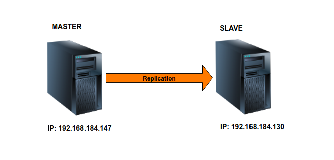
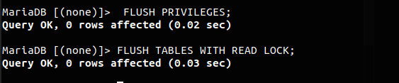
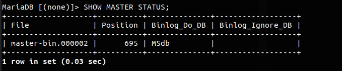
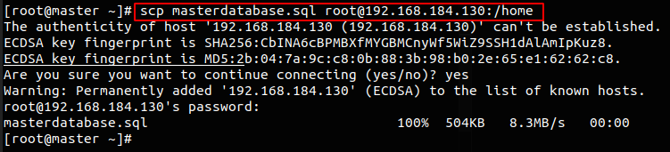
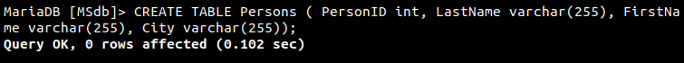
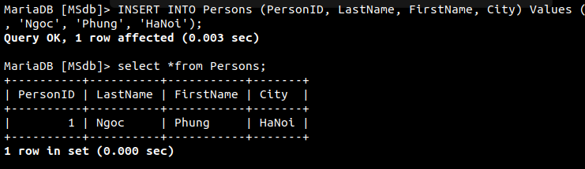
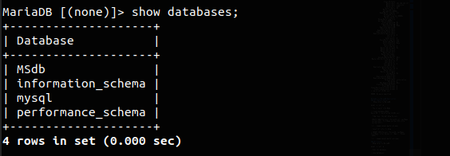
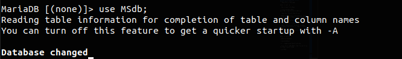
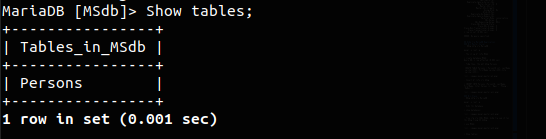

# Cách thiết lập MariaDB Master-Slave Replication trên CentOS 8

## Môi trường cài đặt
```
Master node (CentOS 8 64 bit) : IP 192.168.184.147
Slave node: (CentOS 8 64 bit) : IP 192.168.184.130
```
Mô hình cài đặt :




### Bước 1: Cài đặt MariaDB trên Master Server và Slave Server
```
  # yum install -y mariadb-server
  # systemctl enable mariadb
  # systemctl start mariadb
```
### Bước 2: Thiết lập mật khẩu cho Master và Slave
```
  # mysql_secure_installation
```
```
NOTE: RUNNING ALL PARTS OF THIS SCRIPT IS RECOMMENDED FOR ALL MariaDB
      SERVERS IN PRODUCTION USE!  PLEASE READ EACH STEP CAREFULLY!

In order to log into MariaDB to secure it, we'll need the current
password for the root user.  If you've just installed MariaDB, and
you haven't set the root password yet, the password will be blank,
so you should just press enter here.

Enter current password for root (enter for none): 
OK, successfully used password, moving on...

Setting the root password ensures that nobody can log into the MariaDB
root user without the proper authorisation.

Set root password? [Y/n] y
New password:   ## Enter new password
Re-enter new password:  ## Enter password again
Password updated successfully!
Reloading privilege tables..
 ... Success!


By default, a MariaDB installation has an anonymous user, allowing anyone
to log into MariaDB without having to have a user account created for
them.  This is intended only for testing, and to make the installation
go a bit smoother.  You should remove them before moving into a
production environment.

Remove anonymous users? [Y/n] y 
 ... Success!

Normally, root should only be allowed to connect from 'localhost'.  This
ensures that someone cannot guess at the root password from the network.

Disallow root login remotely? [Y/n] y 
 ... Success!

By default, MariaDB comes with a database named 'test' that anyone can
access.  This is also intended only for testing, and should be removed
before moving into a production environment.

Remove test database and access to it? [Y/n] y  
 - Dropping test database...
 ... Success!
 - Removing privileges on test database...
 ... Success!

Reloading the privilege tables will ensure that all changes made so far
will take effect immediately.

Reload privilege tables now? [Y/n] y
 ... Success!

Cleaning up...

All done!  If you've completed all of the above steps, your MariaDB
installation should now be secure.

Thanks for using MariaDB!
```

### Bước 3: Cấu hình cơ sở dữ liệu Master Server
- Cho phép cổng 3306 của MariaDB trên tường lửa CentOS 8. 
Để thực hiện điều này, hãy chạy các lệnh :
```
# firewall-cmd --add-port=3306/tcp --zone=public --permanent
```
- Reload tường lửa để thực hiện các thay đổi:
```
# firewall-cmd --reload
```

- Mở tệp cấu hình `/etc/mysql.cnf` trên máy chủ chính :
```
vi /etc/my.cnf
``` 
Chúng ta thực hiện một vài thay đổi như sau:

```
[mysqld]
server_id=1
log-basename=master
log-bin
binlog-format=row
binlog-do-db=MSdb
[...]
```
- Trong đó:  

   - `server_id=1` : Bạn có thể chọn bất kỳ số nào cho vị trí này, nhưng số này phải là duy nhất và không trùng với bất kỳ id máy chủ nào khác trong nhóm sao chép của bạn.
    - `log-basename=master` : Tên cơ sở 
    - `log-bin` : Đây là nơi giữ các chi tiết thực sự của bản sao.
    - `binlog-format=row` : Định dạng Binlog là row
    - `binlog-do-db=MSdb` : Cơ sở dữ liệu sẽ được sao chép trên master.   

- Tiếp theo, khởi động lại dịch vụ MariaDB bằng lệnh: 
```
systemctl restart mariadb
```
- Đăng nhập vào MariaDB với tư cách là người dùng root:
```
mysql -u root -p
```
- Tạo Database MSdb:
```
> Create Database MSdb;
```

- Tạo một người dùng Slave và mật khẩu. Ví dụ: chúng tôi sẽ sử dụng Slave_user làm tên người dùng Slave và slave@123 làm mật khẩu:
```
> CREATE USER 'Slave_user'@'%' IDENTIFIED BY 'slave@123';
```

- Cấp quyền cho user Slave_user:
```
> GRANT REPLICATION SLAVE ON *.* TO 'Slave_user'@'%' IDENTIFIED BY 'slave@123';
```

- Ngăn chặn mọi thay đổi đối với dữ liệu trong khi bạn xem vị trí binary log:
```
> FLUSH PRIVILEGES; 
> FLUSH TABLES WITH READ LOCK;
```
 

- Lệnh `SHOW MASTER STATUS` trả về vị trí hiện tại trong binary log (tọa độ chính xác cho biết chính xác điểm nào mà slave sẽ bắt đầu sao chép:

 


## Bước 4 : Sao lưu cơ sở dữ liệu trong máy chủ Master và chuyển nó sang Slave 

- Chạy lệnh bên dưới để sao lưu tất cả các cơ sở dữ liệu Master
```
mysqldump --all-databases --user=root --password --master-data > masterdatabase.sql
```
- Đăng nhập vào MySQL với tư cách người dùng root:
```
mysql -u root -p
```
- Và thực hiện unlock tables , sau đó thoát:
```
MariaDB [(none)]> UNLOCK TABLES;
MariaDB [(none)]> exit;
```
 

-  Sao chép tệp masterdatabase.sql vào máy chủ Slave của bạn.
```
scp masterdatabase.sql root@192.168.184.130:/home
```


### Bước 5 : Cấu hình MariaDB Slave Server

- Chỉnh sửa tập tin /etc/my.cnf 
```
vi /etc/my.cnf
```
- Thêm vào những nội dung sau:
```
[mysqld]
server-id = 2
replicate-do-db=MSdb
[...]
```
Ở đây, MSdb là cơ sở dữ liệu được tạo trên nút Máy chủ. Ngoài ra, hãy chú ý sử dụng id máy chủ khác nhau cho cả máy chủ master và máy chủ slave. Trong trường hợp này, id máy chủ là 2.

- Tiếp theo, chúng ta sẽ nhập cơ sở dữ liệu chủ như được hiển thị
```
mysql -u root -p < /home/masterdatabase.sql 
```
- Sau đó restart lại mariadb:
```
systemctl restart mariadb
```
- Login vào MariaDB bằng tài khoản root :
```
mysql -u root -p
```
- Stop Slave. Hướng dẫn Slave tìm `Master log file` và start Slave 
```
  > STOP SLAVE;
Query OK, 0 rows affected (0.012 sec)
  > CHANGE MASTER TO MASTER_HOST='192.168.184.147', MASTER_USER='slave_user', MASTER_PASSWORD='slave@123', MASTER_LOG_FILE='mariadb-bin.000002', MASTER_LOG_POS=695;
Query OK, 0 rows affected (0.051 sec)
  > START SLAVE;
Query OK, 0 rows affected (0.044 sec)
```
- Kiểm tra trạng thái của Slave, sử dụng lệnh:
```
  > show slave status\G;
```
```
MariaDB [(none)]> show slave status\G;
*************************** 1. row ***************************
                Slave_IO_State: 
                   Master_Host: 192.168.184.147
                   Master_User: slave_user
                   Master_Port: 3306
                 Connect_Retry: 60
               Master_Log_File: mariadb-bin.000001
           Read_Master_Log_Pos: 314
                Relay_Log_File: mariadb-relay-bin.000001
                 Relay_Log_Pos: 4
         Relay_Master_Log_File: mariadb-bin.000001
              Slave_IO_Running: No
             Slave_SQL_Running: No
               Replicate_Do_DB: MSdb
           Replicate_Ignore_DB: 
            Replicate_Do_Table: 
        Replicate_Ignore_Table: 
       Replicate_Wild_Do_Table: 
   Replicate_Wild_Ignore_Table: 
                    Last_Errno: 0
                    Last_Error: 
                  Skip_Counter: 0
           Exec_Master_Log_Pos: 314
               Relay_Log_Space: 256
               Until_Condition: None
                Until_Log_File: 
                 Until_Log_Pos: 0
            Master_SSL_Allowed: No
            Master_SSL_CA_File: 
            Master_SSL_CA_Path: 
               Master_SSL_Cert: 
             Master_SSL_Cipher: 
                Master_SSL_Key: 
         Seconds_Behind_Master: NULL
 Master_SSL_Verify_Server_Cert: No
                 Last_IO_Errno: 0
                 Last_IO_Error: 
                Last_SQL_Errno: 0
                Last_SQL_Error: 
   Replicate_Ignore_Server_Ids: 
              Master_Server_Id: 0
                Master_SSL_Crl: 
            Master_SSL_Crlpath: 
                    Using_Gtid: No
                   Gtid_IO_Pos: 
       Replicate_Do_Domain_Ids: 
   Replicate_Ignore_Domain_Ids: 
                 Parallel_Mode: conservative
                     SQL_Delay: 0
           SQL_Remaining_Delay: NULL
       Slave_SQL_Running_State: 
              Slave_DDL_Groups: 0
Slave_Non_Transactional_Groups: 0
    Slave_Transactional_Groups: 0
1 row in set (0.001 sec)

ERROR: No query specified
```

## Kiểm tra MariaDB Replication 
### Bên Master Server :
-  Đăng nhập vào MariaDB :
```
mysql -u root -p
```
- Tạo cơ sở dữ liệu MSdb 
```
> create database MSdb;
Query OK, 1 row affected (0.003 sec)
``` 
- Tiếp theo, tạo một bảng Persons
```
 CREATE TABLE Persons ( PersonID int, LastName varchar(255), FirstName varchar(255),City varchar(255));
```


- Insert dữ liệu vài bảng
```
> INSERT INTO Persons (PersonID, LastName, FirstName, City) Values (1, 'Ngoc', 'Phung', 'HaNoi');
```


### Bên Slave 
- Đăng nhập vào MariaDB :
```
mysql -u root -p
```
- Hiển thị Database
```
> show databases;
```


- Truy cập vào CSDL MSdb, kiểm tra xem có tồn tại bảng trong đó không
```
> use MSdb;
```


```
> Show tables;
```
 

```
> Select *from Persons;
```
