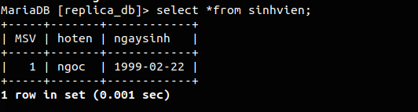
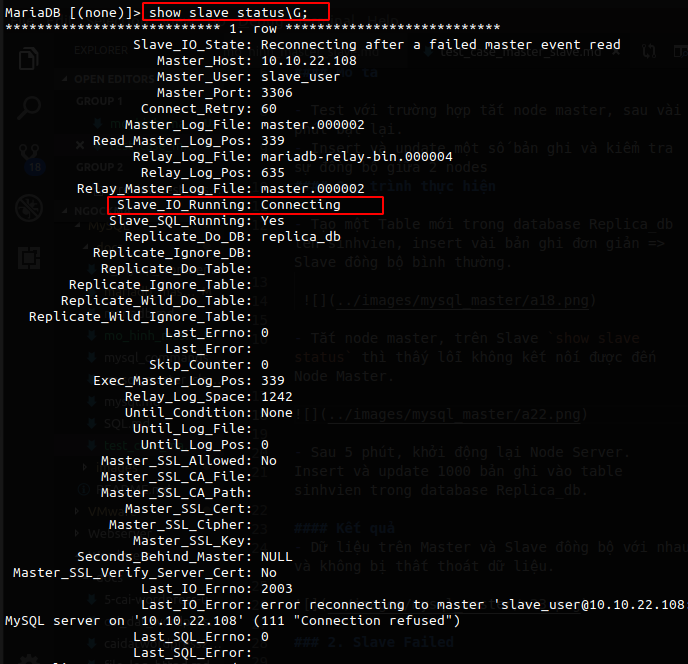
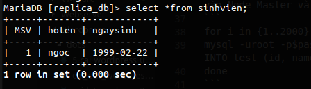

# Các Test Case cho MariaDB Master Slave

# Mục lục 
[I. Test case 1 - Node Failed](#I)
- [1. Master Failed](#1)
- [2. Slave Failed](#2)  

[II. Test case 2 - Promoting a Slave to Master](#II)   
[III. Test case 3 - Backup/Restore khi hệ thống Master Slave gặp sự cố ](#III)

<a name="I"></a>

## I. Test case 1 - Node Failed 

<a name="1"></a>

### 1. Master Failed

#### Mô tả

- Test với trường hợp tắt node master, sau vài phút bật lại.
- Insert và update một số bản ghi và kiểm tra sự đồng bộ giữa 2 nodes.
#### Quy trình thực hiện

- Tạo một Table mới trong database Replica_db tên sinhvien, insert vài bản ghi đơn giản => Slave đồng bộ bình thường.

  

- Tắt node master, trên Slave `show slave status` thì thấy lỗi không kết nối được đến Node Master.

 

- Sau 5 phút, khởi động lại Node Server.
Insert và update 1000 bản ghi vào table sinhvien trong database Replica_db.

#### Kết quả
- Dữ liệu trên Master và Slave đồng bộ với nhau và không bị thất thoát dữ liệu.

 

<a name="2"></a>

### 2. Slave Failed

#### Mô tả

- Test với trường hợp tắt node slave, sau vài giây bật lại
- Insert và update một số bản ghi và kiểm tra sự đồng bộ giữa 2 nodes khi service MariaDB bất ngờ bị stop trong quá trình insert dữ liệu.

#### Quy trình thực hiện
- Tạo Script đơn giản để insert 2000 bản ghi vào Node Master và thực thi.
```
for i in {1..2000}; do
mysql -uroot -ppass -e "use opencps; INSERT INTO sinhvien (id, name) VALUES ($i, 'test');"
done
```
- Trong quá trình chạy, đột ngột tắt Node Slave.
- Bật lại Node Slave.
#### Kết quả
- Slave database tiếp tục pull dữ liệu từ master về tính từ thời điểm Slave gặp sự cố. 

<a name="II"></a>

## II. Test case 2 - Promoting a Slave to Master 
### Mô tả

- Giả lập Master bị hỏng
- Chuyển node slave thành node master tạm thời
- Sau khi dựng lại node master cũ, đưa node master cũ trở về master, node master tạm thời trở lại về node slave
### Quy trình thực hiện

- Master hỏng và không thể khôi phục hoạt động.
- Chuyển Node Slave thành Node Master bằng cách:
    - Vào file `/etc/my.cnf` bỏ dòng `read-only=1`
    - Đăng nhập vào Slave Database và xóa cấu hình slave cũ bằng câu lệnh 
     ```
     > stop slave;
     > reset slave all;
     Reset mariaDB service
     systemctl restart mariadb
     ```
    - Trỏ app về địa chỉ IP của Master tạm thời đó.
- Hệ thống tiếp tục hoạt động bình thường
- Khi Master cũ đã sẵn sàng hoạt động, trả lại Role Master cho Server đó bằng cách:
    - Vào Master tạm thời, dump lại database đồng bộ để đảm bảo không mất mát dữ liệu ra file backup.sql
    - Import backup.sql vào Master cũ và lấy các thông số về Master_log_file và master_log_pos
    - Master tạm thời lại chuyển thành slave bằng việc set read-only trong file /etc/my.cnf và chạy các câu lệnh:
    ```
     > change master to master_host='10.10.22.xxx',
     master_user='slave',
     master_password='XXXXXXX',
     master_port=3306,
     master_log_file='master-bin.00000x',
     master_log_pos=xxx,
     master_connect_retry=10;
     > start slave;
    ```
- Sau khi xong, kiểm tra lại trên slave Database bằng câu lệnh
```
show slave status\G;
```
- Thử insert vài bản ghi trên Master để kiểm tra.
### Kết quả:

- Hệ thống vẫn hoạt động cho khi Node Slave chuyển sang Master. Việc thay đổi Role này khá đơn giản và nhanh, đáp ứng được yêu cầu đề ra về tính sẵn sàng và đảm bảo dữ liệu.

<a name="III"></a>

## III. Test case 3 - Backup/Restore khi hệ thống Master Slave gặp sự cố 
### Mô tả

- Khi master gặp sự cố mất mát dữ liệu (record, Table, Schema v.v..) dẫn đến việc Slave cũng đồng bộ theo và khiến cho dữ liệu hệ thống mất đi.
- Sử dụng bản backup gần nhất để khôi phục dữ liệu trên Master và kiểm tra xem Slave có đồng bộ lại không hay sẽ phải import lại CSDL trên Slave như khi mới khởi tạo Master-Slave
### Quy trình thực hiện

- Sử dụng bản backup mới nhất, đầy đủ nhất để thực hiện việc import lại CSDL OpenCPS.
```
mysql -uroot -p$pass opencps < opencps_bak.sql
```
- Sử dụng các binary logs để tiếp tục restore Incremental (cần phải xem binary log file để xem thời điểm chính xác).
```
mysqlbinlog master-bin.000001 master-bin.000002 master-bin.000003 | mysql -uroot -p$pass
```
### Kết quả:

- 2 table usergroup và usergrouprole đã được khôi phục.
- Dữ liệu của Database đã được phục hồi đến thời điểm trước khi bị mất dữ liệu.