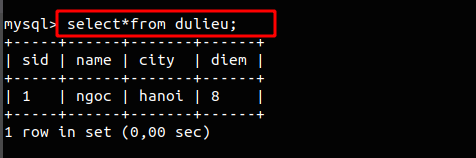
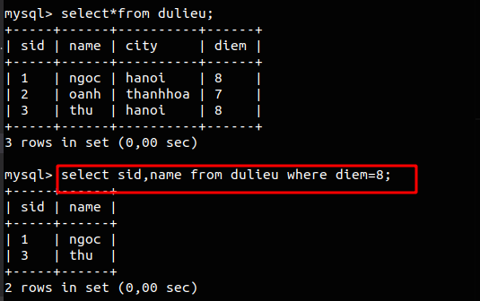

# Danh sách các lệnh SQL

## Giới thiệu 
SQL, Structured Query Language là một ngôn ngữ lập trình được thiết kế để quản lý dữ liệu được lưu trữ trong cơ sở dữ liệu quan hệ. SQL hoạt động thông qua các câu lệnh khai báo đơn giản. Điều này giữ cho dữ liệu chính xác và an toàn, và nó giúp duy trì tính toàn vẹn của cơ sở dữ liệu.  

## Các lệnh trong SQL
##  ALTER Table
Câu lệnh ALTER được sử dụng khi bạn muốn thay đổi tên của bảng hoặc bất kỳ trường bảng nào. Nó cũng được sử dụng để thêm hoặc xóa một cột hiện có trong một bảng.  
### 1. ADD 1 cột vào bảng 
```
ALTER TABLE table_name  
ADD new_column_name column_definition;
```
Trong đó :
- table_name : tên bảng bạn muốn sửa.
- new_column_name : tên của cột mới mà bạn muốn thêm vào bảng.
- column_definition : kiểu dữ liệu và định nghĩa của cột (NULL hoặc NOT NULL, v.v.)

### 2. ADD nhiều cột vào 1 bảng
```
 ALTER TABLE table_name  
 ADD new_column_name column_definition  
 [ FIRST | AFTER column_name ],  
ADD new_column_name column_definition  
[ FIRST | AFTER column_name ],  
  ...  
;  
```
### 3. Sửa đổi cột trong bảng
```
ALTER TABLE table_name  
MODIFY column_name column_definition;
```
Lệnh MODIFY được sử dụng để thay đổi trường của cột trong bảng.
### 4. DROP cột trong bảng
```
ALTER TABLE table_name  
DROP COLUMN column_name;  
```
### 5. Ngôn ngữ truy vấn dữ liệu
```
SELECT [DISTINCT] <DS>|*|<Biểu thức>|<Hàm TV>
FROM <DS bảng>
[WHERE <Điều kiện tìm kiếm>]
[GROUP BY <DS cột> [HAVING <Điều kiện>]]
[ORDER BY <Danh sách cột> [ASC|DESC]]
[UNION |INTERSECT| MINUS <Câu truy vấn khác>;
```
- Truy vấn không điều kiện trên 1 bảng 
```
SELECT column_name 
FROM table_name;
```
Ví dụ:

 

- Truy vấn có điều kiện trên 1 bảng
```
SELECT column_name,column_name...
FROM   Table_name
WHERE  condition_expression;
``` 
Ví dụ :

 

- Truy vấn phức tạp trên nhiều bảng 
```
SELECT  T1.C1,T1.C2,T2.C1,T2.C4, ...
FROM    T1, T2
WHERE   condition_expression;
```
- Từ khóa DISTINCT
Từ khóa DISTINCT được sử dụng trong câu lệnh Select để loại bỏ ra khỏi dữ liệu truy vấn những dòng dữ liệu có gía trị giống nhau.
```
SELECT DISTINCT <bt1>, <bt2>, ...
FROM <bang1>,<bang2>, ...
```
### 6. Insert dữ liệu
```
INSERT [INTO] table_name
VALUES(value1, value2, ...)
```  
### 7. Update dữ liệu
```
UPDATE  updated_table_name
SET     colname = expression
       [, ..., colname = expression ]
[FROM  table_name [,..., table_name]]
[WHERE conditions ] 
```
### 8.Các hàm tập hợp 

SQL cung cấp 5 hàm tập hợp:

- SUM(<tên thuộc tính>) - tính tổng các giá trị của thuộc tính  
- MAX(<tên thuộc tính>) - tìm giá trị lớn nhất của thuộc tính
- MIN(<tên thuộc tính>) - tìm giá trị nhỏ nhất của thuộc tính
- AVG(<tên thuộc tính>) - tính giá trị trung bình của thuộc tính
- COUNT(*) - đếm số dòng của bảng
- COUNT(<tên thuộc tính>) - đếm các giá trị khác null của thuộc tính 

Chỉ được xuất hiện trong mệnh đề SELECT hoặc HAVING

### 9. Truy vấn lồng nhau 

- Là trường hợp các câu truy vấn (con) được viết
lồng nhau
- Thường được sử dụng để  :  Kiểm tra thành viên tập hợp (IN, NOT IN), So sánh tập hợp (>ALL, >=ALL, <ALL,<=ALL,=ALL, )

Ví dụ:
```
SELECT *FROM Supplier
WHERE SIZE>=ALL(SELECT SIZE FROM Supplier); 
```  
- Kiểm tra thành viên tập hợp với IN
và NOT IN:   

Đưa ra mã số của các hãng cung ứng
đồng thời 2 mặt hàng P1 và P2:  
```
SELECT DISTINCT sid FROM SupplyProduct
WHERE pid = ‘P1’ AND sid IN (SELECT sid FROM
SupplyProduct SP2 WHERE SP2.pid = ‘P2’);
```
### 10. Mệnh đề order by 

Dùng để sắp xếp các kết quả trả về sau khi truy vấn

Cú pháp
```
SELECT truong1, truong2,...truongN FROM ten_bang
ORDER BY truong1, [truong2...] [ASC [DESC]]
```
### 11. Sử dụng join

Được sử dụng để lấy dữ liệu từ nhiều bảng và ghép chúng lại với nhau
```
SELECT truong1, truong2 
    FROM bang1  function JOIN bang 2
    on bang1.truong = bang2.truong;
```
Một số function trong lệnh join

- inner join : lấy những phần chung của 2 bảng.
