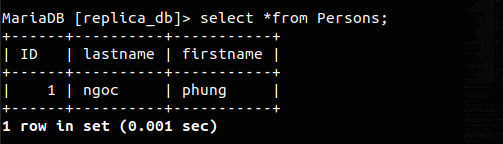

# Cách thiết lập MariaDB Master-Slave Replication trên CentOS 8

## Môi trường cài đặt
```
Master node (CentOS 8 64 bit) : IP 192.168.184.147
Slave node: (CentOS 8 64 bit) : IP 192.168.184.130
```
Mô hình cài đặt :


## Cấu hình cơ sở dữ liệu chủ master

### Bước 1: Mở tệp cấu hình `/etc/mysql.cnf` trên máy chủ chính :
```
vi /etc/my.cnf
``` 
Chúng ta thực hiện một vài thay đổi như sau:

```
[mysqld]
server_id=1
log-basename=master
log-bin
binlog-format=row
binlog-do-db=MSdb
[...]
```

- `server_id=1` : Bạn có thể chọn bất kỳ số nào cho vị trí này, nhưng số này phải là duy nhất và không trùng với bất kỳ id máy chủ nào khác trong nhóm sao chép của bạn.
- `log-basename=master` : Tên cơ sở 
- `log-bin` : Đây là nơi giữ các chi tiết thực sự của bản sao.
- `binlog-format=row` Định dạng Binlog là row
- `binlog-do-db=MSdb` : Cơ sở dữ liệu sẽ được sao chép trên master.

Tiếp theo, khởi động lại dịch vụ MariaDB bằng lệnh: 
```
systemctl restart mariadb
```
### Bước 2: Đăng nhập vào MariaDB với tư cách là người dùng root:
```
mysql -u root -p
```
Tạo Database MBdb :
```
Create Database MSdb;
```
 

Tạo một người dùng Slave và mật khẩu. Ví dụ: chúng tôi sẽ sử dụng Slave_user làm tên người dùng Slave và slave@123 làm mật khẩu:
```
CREATE USER 'Slave_user'@'192.168.184.130' IDENTIFIED BY 'slave@123';
```
 

Cấp quyền cho user Slave_user:
```
GRANT REPLICATION SLAVE ON *.* TO 'Slave_user'@'192.168.184.130' IDENTIFIED BY 'slave@123';
```

 

Ngăn chặn mọi thay đổi đối với dữ liệu trong khi bạn xem vị trí binary log:
```
FLUSH PRIVILEGES; 
FLUSH TABLES WITH READ LOCK;
```
 

Lệnh `SHOW MASTER STATUS` trả về vị trí hiện tại trong binary log (tọa độ chính xác cho biết chính xác điểm nào mà slave sẽ bắt đầu sao chép:

 


## Bước 3 : Sao lưu cơ sở dữ liệu trong máy chủ Master và chuyển nó sang Slave 

Tiếp theo, chạy lệnh bên dưới để sao lưu tất cả các cơ sở dữ liệu Master
```
mysqldump --all-databases --user=root --password --master-data > masterdatabase.sql
```
Đăng nhập vào MySQL với tư cách người dùng root:
```
mysql -u root -p
```
Và, mở khóa các bảng , sau đó thoát:
```
MariaDB [(none)]> UNLOCK TABLES;
MariaDB [(none)]> exit;
```
 

### Bước 4 : Sao chép tệp masterdatabase.sql vào máy chủ Slave của bạn.
```
scp masterdatabase.sql root@192.168.184.130:/home
```


## Cấu hình MariaDB Slave

### Bước 1 : Chỉnh sửa tập tin /etc/my.cnf 
```
vi /etc/my.cnf
```
Thêm vào những nội dung sau:
```
[mysqld]
server-id = 2
replicate-do-db=MSdb
[...]
```
Ở đây, MSdb là cơ sở dữ liệu được tạo trên nút Máy chủ. Ngoài ra, hãy chú ý sử dụng id máy chủ khác nhau cho cả máy chủ master và máy chủ slave. Trong trường hợp này, id máy chủ là 2.

Tiếp theo, chúng ta sẽ nhập cơ sở dữ liệu chủ như được hiển thị
```
mysql -u root -p < /home/masterdatabase.sql 
```
Sau đó restart lại mariadb:
```
systemctl restart mariadb
```


