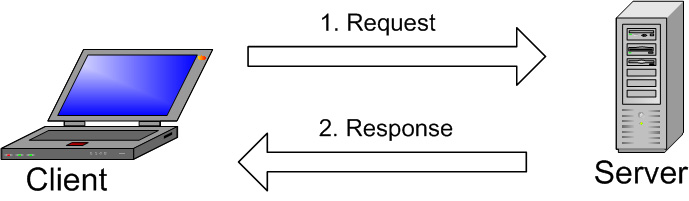
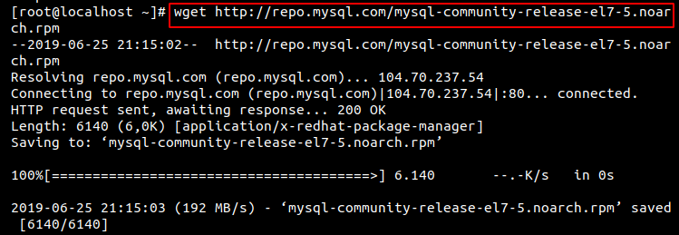
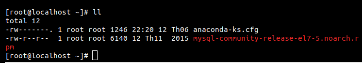
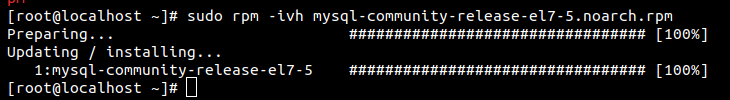
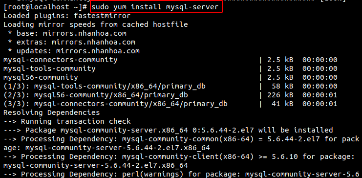
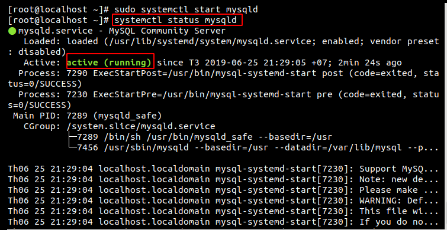

# Mục lục 
Contents
1. [MySQL là gì? Lịch sử phát triển MySQL là gì ?](#a)
2. [MySQL hoạt động như thế nào?](#b)
3. [Cách cài đặt MySQL trên CentOS7](#c)
<a name="a">

# MySQL</a> 

## 1. MySQL là gì ? Lịch sử phát triển MySQL là gì ?

### Lịch sử phát triển
- Phiên bản đầu tiên của MySQL phát hành năm 1995
- Công ty Sun Microsystems mua lại MySQL AB trong năm 2008
- Năm 2010 tập đoàn Oracle thâu tóm Sun Microsystems. Ngay lúc đó, đội ngũ phát triển của MySQL tách MySQL ra thành 1 nhánh riêng gọi là MariaDB. Oracle tiếp tục phát triển MySQL lên phiên bản 5.5.
- MySQL hiện nay có 2 phiên bản miễn phí (MySQL Community Server) và có phí (Enterprise Server).
- MySQL là một hệ thống quản trị cơ sở dữ liệu mã nguồn mở (Relational Database Management System, viết tắt là RDBMS) hoạt động theo mô hình client-server. 
- MySQL được phát triển, phân phối và hỗ trợ bởi Oracle Corporation và được đặt tên theo tên của con gái người đồng sáng lập Monty Widenius: My. Ngoài MySQL ra, còn một số DBMS khác như Oracle, PostgreSQL, SQLite… MySQL có thể được cài đặt trên nhiều nền tảng hệ điều hành khác nhau như Windows, Linux và Mac OS X.
### Khái niệm
- MySQL là một hệ thống quản trị cơ sở dữ liệu mã nguồn mở (Relational Database Management System, viết tắt là RDBMS) hoạt động theo mô hình client-server. 
-  RDBMS là một phần mềm hay dịch vụ dùng để tạo và quản lý các cơ sở dữ liệu (Database) theo hình thức quản lý các mối liên hệ giữa chúng.
#### Database 
- Database là tập hợp dữ liệu theo cùng một cấu trúc.Cơ sở dữ liệu, hay database, là nơi chứa và sắp đặt dữ liệu.
#### Open source
- Open source là mã nguồn mở ,nghĩa là ai cũng có thể dùng và chỉnh sửa nó. Bất kỳ ai cũng có thể cài đặt phần mềm này.
#### SQL (Structured Query Language)
- Client và server liên lạc với nhau trong môi trường của RDBMS ,Chúng sử dụng ngôn ngữ truy vấn có cấu trúc chung – Structured Query Language (SQL).
- SQL không chỉ dùng để truy xuất dữ liệu mà SQL được sử dụng để điều khiển tất cả các chức năng mà một hệ quản trị cơ sở dữ liệu cung cấp cho người dùng.

<b name="b">

## 2. MySQL hoạt động như thế nào?</b>


1. MySQL tạo ra bảng để lưu trữ dữ liệu, định nghĩa sự liên quan giữa các bảng đó.
2. Client sẽ gửi yêu cầu SQL bằng một lệnh đặc biệt trên MySQL.
3. Ứng dụng trên server sẽ phản hồi thông tin và trả về kết quả trên máy client.

<c name="c">

## 3. Cách cài đặt MySQL trên CentOS7</c>

### Bước 1 : Tải và chuẩn bị MySQL repository
Download file với lệnh sau:
```
wget http://repo.mysql.com/mysql-community-release-el7-5.noarch.rpm
```




Giờ bạn đã có thể prepare repository rồi cài đặt MySQL packages từ nó. Hãy gõ lệnh:
```
sudo rpm -ivh mysql-community-release-el7-5.noarch.rpm
```


### Bước 2 : Hướng dẫn cài MySQL trên server

Giờ bạn đã có thể cài đặt MySQL ngay bằng dòng lệnh này:
```
sudo yum install mysql-server
```



###Bước 3 : Khởi động MySQL và kiểm tra xem nó có hoạt động không

MySQL chưa được khởi động sau khi cài đặt xong, nên bạn cần khởi động với lệnh sau:
```
sudo systemctl start mysqld
```
Để kiểm tra hãy gõ lệnh sau:
```
systemctl status mysqld 
```
