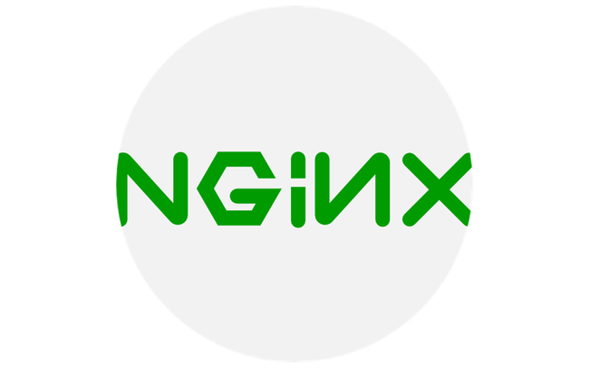
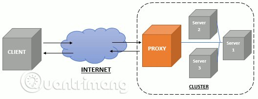
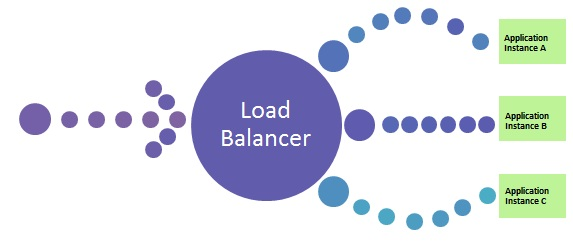

# Tổng quan về NGINX

## Mục lục
[1. NGINX là gì? ](#1)  
[2. Các khái niệm liên quan](#2)   
[3. Tính năng NGINX ](#3)  

  

## 1. NGINX là gì?

- NGINX, đọc là “engine-ex,”  là một phần mềm web server mã nguồn mở.Ngoài các khả năng của máy chủ HTTP, NGINX cũng có thể hoạt động như một máy chủ proxy cho email (IMAP, POP3 và SMTP) và một trình cân bằng tải và proxy ngược cho các máy chủ HTTP, TCP và UDP.

- NGINX xuất bản chính thức vào tháng 10 năm 2004. Nhà sáng lập của phần mềm này là Igor Sysoev, triển khai dự án từ năm 2002 để giải quyết vấn đề C10k. C10k là giới hạn của việc xử lý 10 ngàn kết nối cùng lúc. NGINX sử dụng kiến trúc hướng sự kiện (event-driven) không đồng bộ (asynchronous).

## 2. Các khái niệm liên quan

- Proxy server : (hay còn gọi được là máy chủ proxy) được xem như một phương tiện kết nối người dùng (workstation user) như chúng ta với Internet. Điều này có nghĩa proxy server là vật trung gian cho phép thực hiện các kết nối gián tiếp thay vì trực tiếp như các server thật.
Proxy server giúp tạo ra nhiều proxy. Mà proxy thường để truy cập ẩn danh. Tức là khi chúng ta không muốn địa chỉ IP riêng từ máy tính của mình bị lộ ra dễ dàng, chúng ta sẽ kết nối qua các proxy mới này. Khi đó, IP không phải của máy tính chúng ta nữa mà sẽ là từ proxy server.

- Reverse Proxy : là một proxy server hoạt động với vai trò trung gian giữa máy khách và máy chủ khác. Proxy server lấy tài nguyên từ máy chủ mà bạn muốn kết nối và gửi nó cho bạn để xem. Một reverse proxy hoạt động theo cùng một cách, ngoại trừ vai trò bị đảo ngược. Khi bạn yêu cầu thông tin từ máy chủ, reverse proxy sẽ giữ yêu cầu và gửi nó đến máy chủ backend thích hợp. Điều này cho phép quản trị viên hệ thống sử dụng máy chủ cho nhiều ứng dụng, cũng như đảm bảo luồng lưu lượng truy cập mượt mà hơn giữa máy khách và máy chủ.

   

- Caching : cách tăng tốc website hiệu quả nhất không ai có thể phủ nhận điều này. Khi cấu hình bật cache tốc độ lướt web có thể cải thiện nhiều lần.
- Load balancer : việc phân bố đồng đều lưu lượng truy cập giữa các máy chủ có cùng chức năng trong cùng một hệ thống.   
   Lợi ích : hệ thống giảm thiểu tối đa tình trạng một máy chủ bị quá tải và ngưng hoạt động, tối đa hoá Uptime

   

## 3. Tính năng NGINX

Tính năng chính của NginX :
- Có khả năng xử lý hơn 10.000 kết nối cùng lúc với bộ nhớ thấp.

- Phục vụ tập tin tĩnh (static files) và lập chỉ mục tập tin.

- Tăng tốc reverse proxy bằng bộ nhớ đệm (cache), cân bằng tải đơn giản và khả năng chịu lỗi.

- Reverse proxy server cho HTTP, HTTPS, SMTP, POP3, và IMAP

## TÀI LIỆU THAM KHẢO
- https://www.nginx.com/resources/glossary/nginx/
- https://longvan.net/load-balancing-can-bang-tai-la-gi.html
- https://www.thuysys.com/toi-uu/tim-hieu-caching-va-cach-tang-toc-website-tren-nginx.html
- https://tech.bizflycloud.vn/nginx-la-gi-cach-cai-dat-nginx-20181101092814419.html
- https://edwardthienhoang.wordpress.com/2018/08/20/event-driven-architecture/

