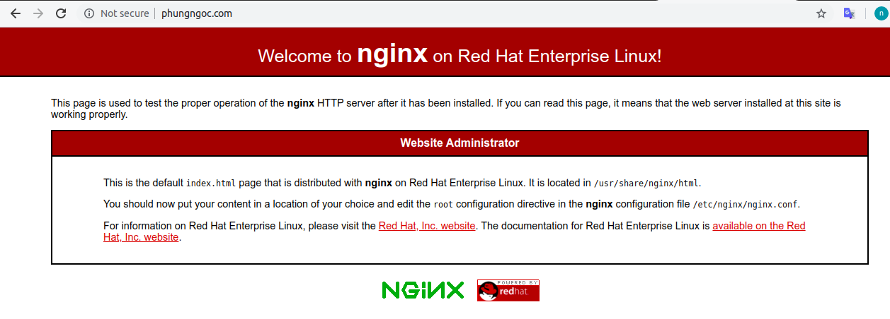
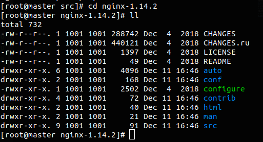

# Cài đặt và cấu hình NGINX trên CentOS8

## Mục lục   

[1. Cài đặt Nginx theo package](#11)

- [Bước 1. Cài đặt Nginx](#1)  
- [Bước 2. Start Nginx service](#2)  
- [Bước 3. Mở HTTP firewall port 80](#3)
- [Bước 4. Truy cập trang Nghinx](#4)  
- [Bước 5. Cấu hình server Nginx](#5)  

[2. Cài đặt Nginx bằng source code](#22)  
- [Bước 1. ]


<a name="11"></a>

## 1. Cài đặt Nginx theo package

<a name="1"></a>  

### Bước 1. Cài đặt Nginx 
- Chúng ta cần add CentOS EPEL package:
  ```
   yum install epel-release
  ```
- Sử dụng lệnh sau để cài đặt Nghix :
  ```
  yum -y install nginx
  ```

<a name="2"></a>

### Bước 2. Start Nginx service

- Để start Nginx ta dùng lệnh :
  ```
  systemctl start nginx
  ```
- Định cấu hình máy chủ để start NGINX khi khởi động lại:
  ```
  systemctl enable nginx
  ```

<a name="3"></a>  

### Bước 3. Mở HTTP firewall port 80

- Mở HTTP firewall port 80 ta dùng lệnh sau:
  ```
  # firewall-cmd --zone=public --permanent --add-service=http
  # firewall-cmd --reload
  ```

<a name="4"></a>

### Bước 4. Truy cập trang Nghinx

- Truy cập trang chào mừng Nginx. Bây giờ tất cả đã sẵn sàng để truy cập Nginx từ một máy chủ từ xa. Mở trình duyệt và điều hướng đến `http://YOURHOSTNAME` URL 

     

<a name="5"></a>

### Bước 5. Cấu hình server Nginx

- Thực hiện cấu hình thêm cho máy chủ của bạn bằng cách chỉnh sửa tệp cấu hình `/etc/nginx/nginx.conf`

- Giới thiệu về cú pháp :

Phần 1 :

  ```
  user nginx;
  worker_processes auto;
  error_log /var/log/nginx/error.log;
  pid /run/nginx.pid;

  # Load dynamic modules. See /usr/share/doc/nginx/README.dynamic.
  include /usr/share/nginx/modules/*.conf;

  events {
    worker_connections 1024;
  }
  ```
  - **user** : cho biết người dùng hệ thống Linux nào sẽ có quyền chạy các máy chủ Nginx. 
  - **worker_processes** : Xác định có bao nhiêu cores của CPU làm việc với Nginx.
  - **pid** : Xác định nơi Nginx sẽ ghi lại master process ID, hoặc PID. PID được sử dụng bởi hệ điều hành để theo dõi và gửi tín hiệu đến quá trình Nginx.
  - **worker_connections** : sẽ cho biết số lượng connection mà CPU sẽ xử lý. Mặc định, số lượng connection này được thiết lập là 1024. Để xem về mức giới hạn sử dụng của hệ thống bạn có thể dụng lệnh `ulimit -n`

Phần 2 : HTTP (Universal Configuration)
  - Bao gồm các đoạn mã chung giúp Nginx xử lý lưu lượng web HTTP.
  ```
  http {
    log_format  main  '$remote_addr - $remote_user [$time_local] "$request" '
                      '$status $body_bytes_sent "$http_referer" '
                      '"$http_user_agent" "$http_x_forwarded_for"';

    access_log  /var/log/nginx/access.log  main;

    sendfile            on;
    tcp_nopush          on;
    tcp_nodelay         on;
    keepalive_timeout   65;
    types_hash_max_size 2048;

    include             /etc/nginx/mime.types;
    default_type        application/octet-stream;

    # Load modular configuration files from the /etc/nginx/conf.d directory.
    # See http://nginx.org/en/docs/ngx_core_module.html#include
    # for more information.
    include /etc/nginx/conf.d/*.conf;
   ```
   - **include** : 
chỉ thị include của nginx có vai trò trong việc thêm nội dung từ một file khác vào trong cấu hình nginx.`include /etc/nginx/conf.d/*.conf;` là bao gồm tất cả file theo một định dạng nào đó.

<a name="22"></a>

## 2. Cài đặt Nginx bằng source code  

### Bước 1 : Cài đặt gói phụ thuộc bằng yum 
```
 yum install -y zlib zlib-devel pcre prce-devel openssl openssl-devel
```
### Bước 2 : Đổi thư mục theo mong muốn để tải xuống
```
cd /usr/local/src/
```
### Bước 3 : Download Nginx  
```
 wget http://nginx.org/download/nginx-1.14.2.tar.gz
```
### Bước 4 : Giải nén gói đã tải
```
tar xfvz nginx-1.14.2.tar.gz  
cd nginx-1.14.2/
```
  


