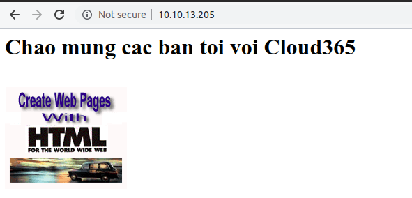

# Lab Nginx reverse proxy & caching


## IP Planning 
IP Nginx : 10.10.13.206   
IP WebServer : 10.10.13.205
## Triển khai
### 1.1. Cài đặt Apache
#### Cài đặt các gói cơ bản  
- Thiết lập IP nếu cần đặt giống mô hình này
- Thực hiện trên máy 10.10.13.205  
- Login với quyền root và thực hiện cài đặt các gói bổ trợ:
```
yum update -y
yum install -y epel-release 
yum install -y wget byobu 
```
#### Cài đặt Apache

- Cài đặt httpd
```
yum install -y httpd
```
- Khởi động httpd và kích hoạt http khi reboot hệ điều hành
```
systemctl start httpd
systemctl enable httpd
```  
#### Tạo một trang web có chứa ảnh hoặc các file tĩnh  



### 1.2. Cài đặt Nginx  

- Thực hiện trên máy chủ Nginx 10.10.13.205  
- Đăng nhập với quyền root và thực hiện cài đặt các gói bổ trợ
```
yum update -y
yum install -y epel-release 
yum install -y wget byobu 
```
- Cài đặt Nginx
```
yum install -y nginx
```
- Khởi động nginx và kích hoạt chế độ khởi động cùng OS.
```
systemctl start nginx
systemctl enable nginx
```
- Kiểm tra hoạt động của nginx
```
systemctl status nginx
```  
### 1.3 Cấu hình nginx làm proxy 

- Sao lưu file cấu hình mặc định của nginx
```
cp /etc/nginx/nginx.conf /etc/nginx/nginx.conf.bka
```
- Di chuyển vào thư mục /etc/nginx/conf.d/để khai báo file cấu hình làm nhiệm vụ reverse proxy.
```
cd /etc/nginx/conf.d/
```
- Tạo file với đuôi mở rộng là .conf
```
vi /etc/nginx/conf.d/web1cloud365.vn.conf
```
Nội dung của file web1cloud365.vn.conf sẽ là:
```
server {
    listen 80;
    server_name web1cloud365.vn;
    access_log /var/log/nginx/web1cloud.access.log;
    error_log /var/log/nginx/web1cloud.error.log;
    
    location / {
        proxy_pass http://10.10.13.205:80/;
        # Input any other settings you may need that are not already contained in the default snippets.
    }
}
```
- Sau khi khai báo xong, kiểm tra lại xem khai báo này đã đúng chưa bằng lệnh
```
nginx -t
```


- Restart nginx : 
```
systemctl restart nginx
```
- Kiểm tra nội dung web và xem revert proxy hoạt động 

  

### 1.4 Cấu hình caching cho nginx  

- Trước tiên cần tạo thư mục chứa các file cache
```
sudo mkdir -p /var/lib/nginx/cache
sudo chown nginx /var/lib/nginx/cache
sudo chmod 700 /var/lib/nginx/cache
```
- Mở file web1cloud365.vn.conf ở phần trước và thêm các dòng này vào phần đầu của file
```
proxy_cache_path /var/lib/nginx/cache levels=1:2 keys_zone=backcache:8m max_size=50m;
proxy_cache_key "$scheme$request_method$host$request_uri$is_args$args";
proxy_cache_valid 200 302 10m;
proxy_cache_valid 404 1m;
```

- Tiếp tục thêm dòng dưới vào directive localtion
```
proxy_cache backcache;
add_header X-Proxy-Cache $upstream_cache_status;
```
- Kiểm tra lại khai báo về cache ở trên bằng lệnh nginx -t 

  

- Kiểm tra xem cache đã hoạt động hay chưa 