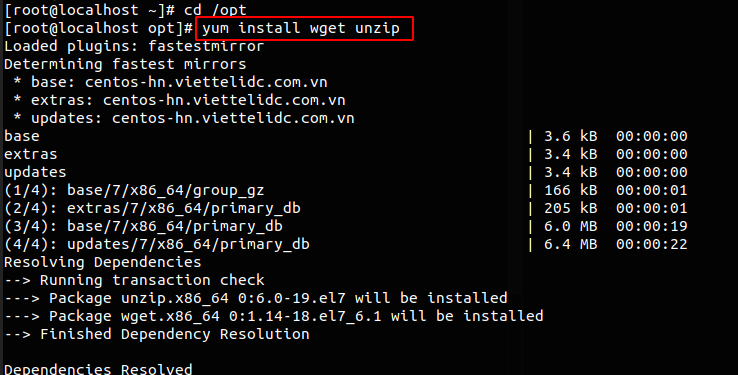
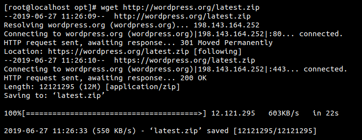
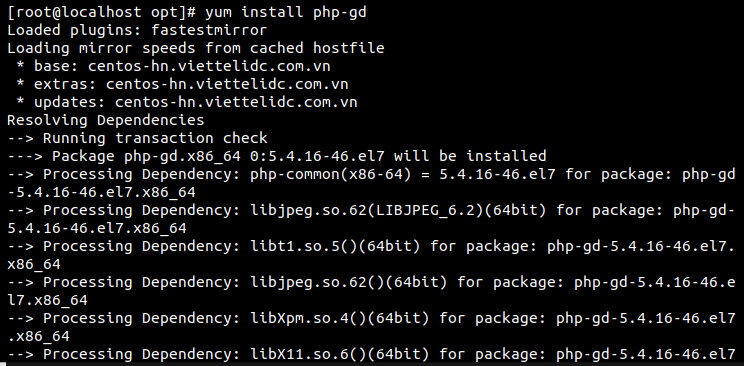

# Cài đặt Wordpress trên CentOS7
## Bước 1: Cài đặt wget
```
yum install wget unzip
```


## Bước 2: Download WordPress
```
wget http://wordpress.org/latest.zip
```


## Bước 3: Install php-gd

```
 yum install php-gd
 ```


## Bước 4: Tạo cơ sở dữ liệu MySql
```
mysql -u root -p
```
```
mysql> CREATE DATABASE wordpress;
mysql> GRANT ALL PRIVILEGES on wordpress.* to 'wpuser'@'localhost' identified by 'your_password';
mysql> FLUSH PRIVILEGES;
mysql> exit
```

## Bước 5:  Restart MySQL:
```
systemctl restart mysqld.service
```
## Bước 6: Giải nén và cấu hình WordPress
```
unzip -q latest.zip -d /var/www/html/
```
Cấp quyền :
```
# chown -R apache: apache / var / www / html / wordpress
# chmod -R 755 / var / www / html / wordpress
```
Tạo thư mục để tải lên:
```
mkdir -p /var/www/html/wordpress/wp-content/uploads
```
Để máy chủ web Apache ghi vào thư mục tải lên ta cần cấp quyền cho máy chủ web:
```
chown -R :apache /var/www/html/wordpress/wp-content/uploads
```
Di chuyển tới thư mục Wordpress:
```
cd /var/www/html/wordpress/
```
## Bước 7: 