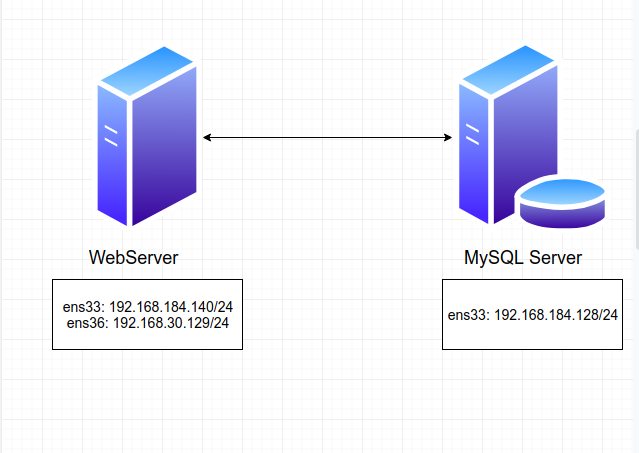
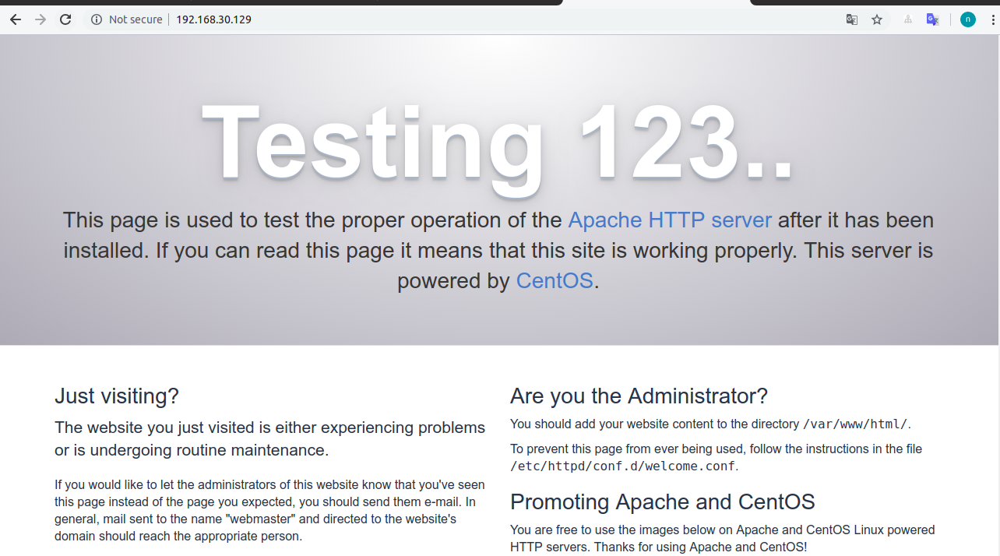
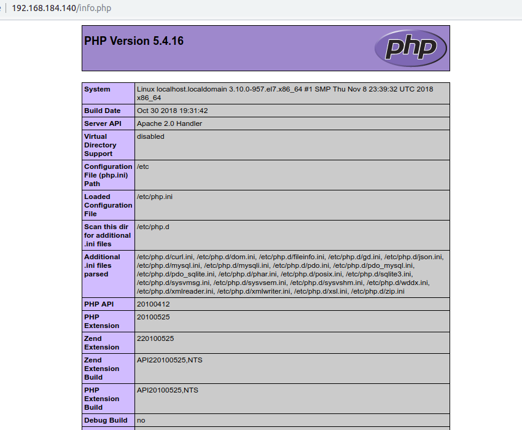
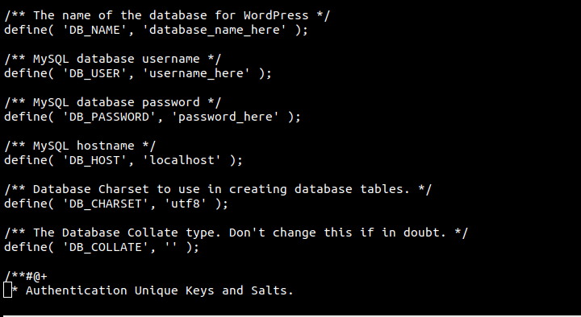
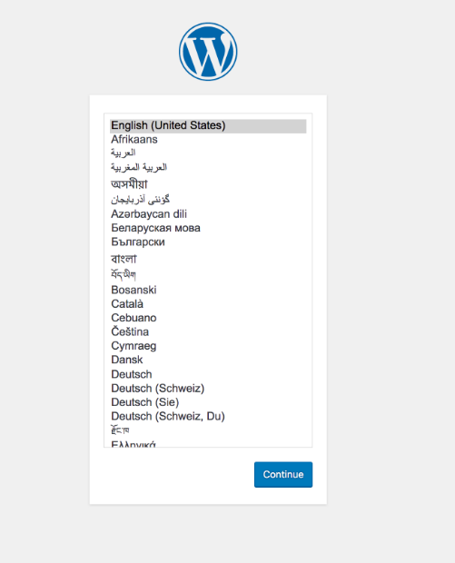

#Mục lục  
1.[Mô hình cài đặt](#a)  
2.[Cấu hình](#b)  
3.[Tổng kết](#c)
# Cài đặt Wordpress trên CentOS7  

<a name="a">

## 1. Mô hình cài đặt </a>



<b name="b">

## 2. Cấu hình </b>

### Trên máy MySQL 
#### Bước 1: Cài đặt MySQL server

Chạy các lệnh sau:

```
wget http://repo.mysql.com/mysql-community-release-el7-5.noarch.rpm

rpm -ivh mysql-community-release-el7-5.noarch.rpm

yum install mysql-server
```

MySQL chưa được khởi động sau khi cài đặt xong, nên bạn cần khởi động với lệnh sau:
```
sudo systemctl start mysqld
```
Để kiểm tra hãy gõ lệnh sau:
```
systemctl status mysqld 
```
Chạy lệnh sau để thiết lập tài khoản root cho MySQL
```
mysql_secure_installation
```
#### Bước 2: Tạo Database cho wordpress

Đăng nhập vào MySQL với user root
```
mysql -u root -p
```
Tạo user và database để sử dụng cho wordpress:
```
CREATE DATABASE name_database;
create user 'user-name'@'IP' identified by 'password';  
GRANT ALL PRIVILEGES ON mydatabase.* TO 'username'@'localhost' IDENTIFIED BY 'mypass' WITH GRANT OPTION;  
flush privileges;
```
Ví dụ:


### Trên máy Web server
#### Bước 1: Cài HTTPD
Chạy lệnh sau để cài đặt
```
yum install httpd -y
```
Cấu hình Apache để bắt đầu khởi động:
```
# systemctl start httpd

# systemctl enable httpd

# systemctl status httpd
```  



#### Bước 2: Cài PHP

Sử dụng yum để cài PHP
```
yum install php php-mysql php-gd php-pear –y
```
Để test PHP đã cài đặt thành công chưa ta dùng lệnh:
```
echo "<?php phpinfo(); ?>" > /var/www/html/info.php
```
Sau đó restart lại httpd
```
systemctl restart httpd
```
Kết quả trả về như sau là thành công:



#### Bước 3: Cài wordpress

Mở thư mục cài WordPress:
```
cd /var/www/html
```
Dowload file để cài wordpress từ internet
```
wget https://wordpress.org/latest.tar.gz
```
Giải nén tập tin
```
tar xzvf latest.tar.gz
```
Cấu hình wordpress để kết nối với MySQL
```
cd /var/www/html/
mv wordpress/* /var/www/html/
mv wp-config-sample.php wp-config.php
```
Sửa file
```
vi wp-config.php
```
Tìm các dòng sau và sửa:



Trong đó:

- database_name_here : tên của database  
- username_here : tên user login vào mysql   
- username_here : password của user login vào mysql  
- localhost : địa chỉ cuả máy MySQL Sever  

Ví dụ:


Mở kết nối sang MySQL server

Bây giờ mở trình duyệt và truy cập địa chỉ của bạn để tiến hành cấu hình wordpress.
```
http://server_domain_name_or_IP
```
Màn hình hiện như dưới là thành công.

