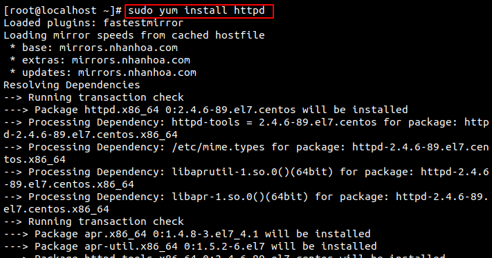
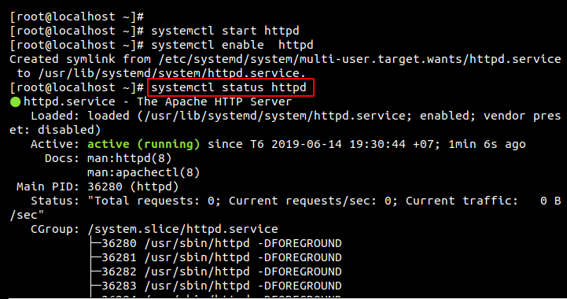
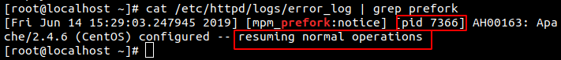
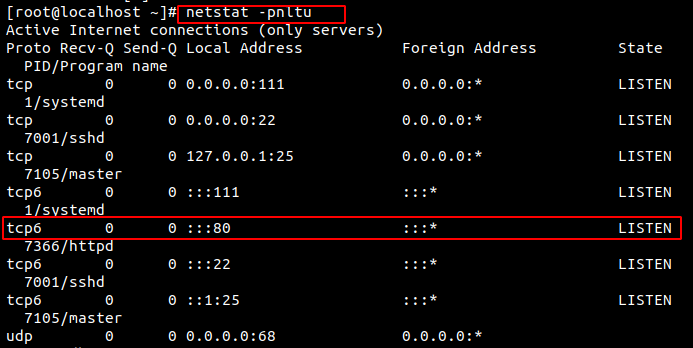
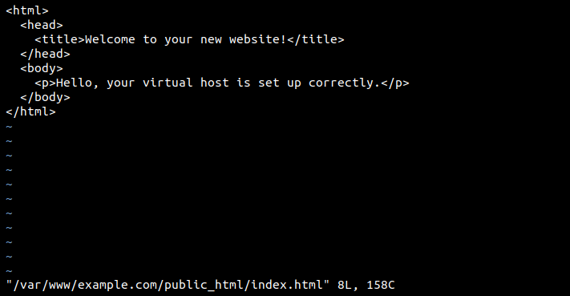
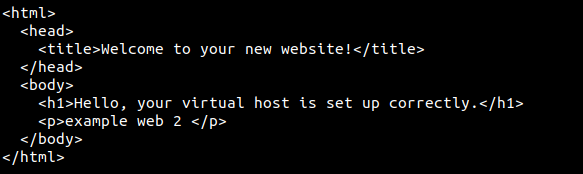
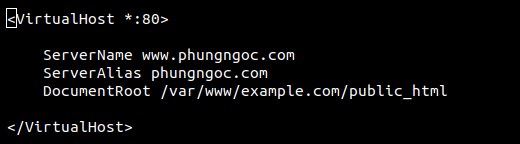
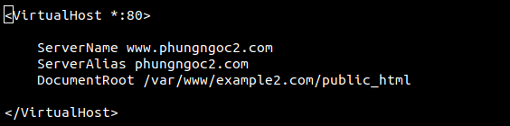
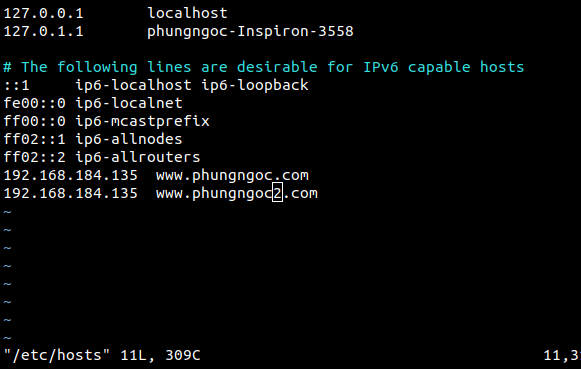
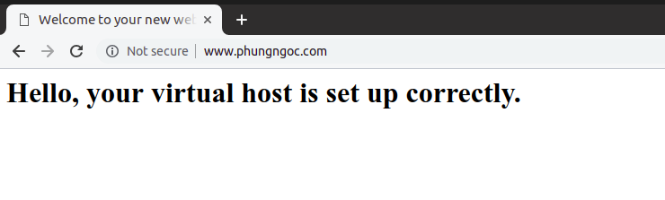

# CÀI ĐẶT APACHE CẤU HÌNH VIRTUAL HOSTS TRÊN CENTOS 7
## 1. Khái niệm 
- Apache là phần mềm web server miễn phí mã nguồn mở, hiện đang là một trong những web server được sử dụng phổ biến trên thế giới. Tên chính thức của Apache là Apache HTTP Server, được điều hành và phát triển bởi Apache Software Foundation.  
## 2. Cài đặt Apache trên CentOS7
Cài đặt Apache đơn giản chạy lệnh:
```
sudo yum -y install httpd
```



Cho phép Apache thông qua tường lửa:

Cấu hình Apache để bắt đầu khởi động:
```
# systemctl start httpd

# systemctl enable httpd

# systemctl status httpd
```  


Xem dịch vụ httpd (apache) và mpm prefork đã start hay chưa dùng lệnh sau.
```
cat /etc/httpd/logs/error_log | grep prefork
```

 

```
netstat -tulpn 
```
 

Kết quả như trên là đã start thành công rồi, Module pmp prefork, apache đã chạy với pid 7366 , Web server đang lắng nghe trên port 80.

Để truy cập được web server ta cần cấu hình firewall allow web traffic : 
 ``` firewall-cmd --zone=public --add-port=80/tcp --permanent ```

## 3. Virtual host 
### a. Khái niệm   

Virtual host là một định nghĩa chỉ chức năng nhúng nhiều tên miền vào một địa chỉ IP của một Server. Và bằng cách cài đặt riêng, Server sẽ nhận biết được tên miền nào sẽ hoạt động ở một folder nào.

### b. Cài đặt và cấu hình Virtual host trên Apache 
1. Tạo cấu trúc thư mục

Mặc dù bạn có thể tạo các thư mục ở bất cứ đâu, theo quy ước chung, các thư mục cho mỗi trang web được đặt trong /var/wwwthư mục và bắt đầu với một thư mục được đặt tên theo URL của trang web.  

Để tạo các thư mục cho example.com các lệnh là:
```
mkdir -p /var/www/example.com/public_html
mkdir -p /var/www/example2.com/public_html
```
Cấp quyền truy cập cho các file trên :
```
chmod -R 755 /var/www  
```
Tạo một tệp thử nghiệm với tên index.html trong tài liệu gốc của trang web:
```
vi /var/www/example.com/html/index.html 
```


Lưu và thoát tệp.  

Copy file vừa cấu hình sang directory của website thứ 2 và chỉnh sửa file index.html :

```
cp /var/www/example.com/public_html/index.html /var/www/example2.com/public_html/index.html
```  



2. Tạo các File Virtual Host mới

Đầu tiên ta sẽ tạo các thư mục để lưu file. Thư mục sites-available lưu trữ tất cả các file server block, còn thư mục sites-enabled sẽ lưu đường dẫn đến server block cần kích hoạt. Tạo hai thư mục đó với lệnh:

```
sudo mkdir /etc/httpd/sites-available
sudo mkdir /etc/httpd/sites-enabled
```  
Tiếp theo ta sẽ chỉ cho Apache tìm kiếm các file server block trong thư mục sites-enabled.
```
sudo nano /etc/httpd/conf/httpd.conf
```
Thêm vào dòng sau vào cuối file 
```
IncludeOptional sites-enabled/*.conf
```
2. Tạo File Virtual host đầu tiên

Tạo và cấu hình file example.com.conf ta dùng lệnh :
```
vi /etc/httpd/sites-available/example.com.conf
```

 

Làm tương tự với web 2:
```
cp /etc/httpd//example.com.conf /etc/httpd/conf.d/example2.com.conf 
```
```
vi /etc/httpd/conf.d/example2.com.conf 
```
File cấu hình :



3. Kích hoạt các File Virtual Host mới

Sau khi tạo các file server block, ta cần kích hoạt chúng bằng cách tạo đường dẫn cho chúng từ thư mục sites-enabled cho chúng: 
```
sudo ln -s /etc/httpd/sites-available/example.com.conf /etc/httpd/sites-enabled/example.com.conf
sudo ln -s /etc/httpd/sites-available/example2.com.conf /etc/httpd/sites-enabled/example2.com.conf
```
Khởi động lại Apache:
```
sudo apachectl restart
```
4. Thiết lập file Local Host  

Ta cần cấu hình file hosts ở một máy client để có thể truy cập vào web server :
```
sudo vi /etc/hosts
```


Sau đó ta kiểm tra bằng cách nhập địa chỉ 2 website vào browser trong máy client :



