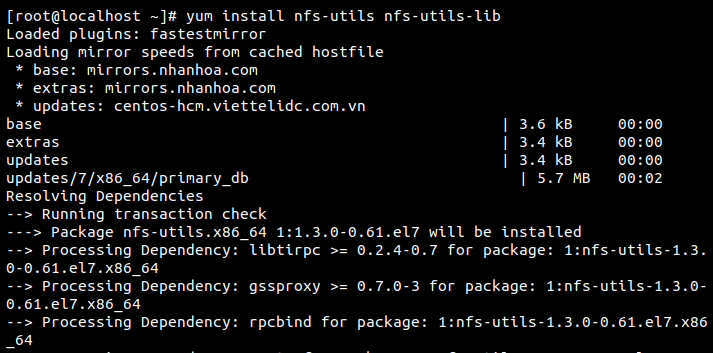
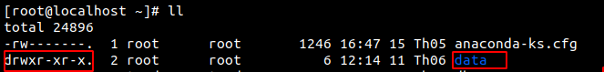
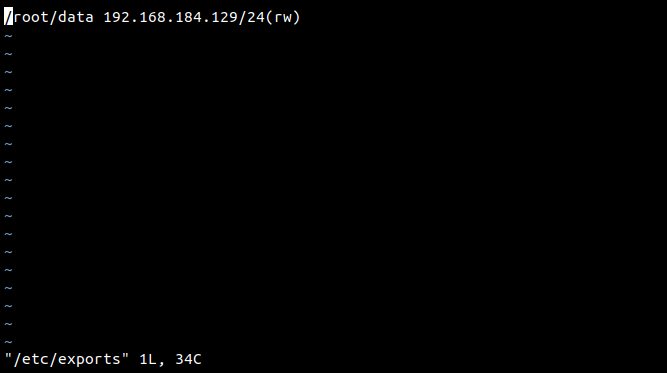
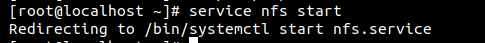
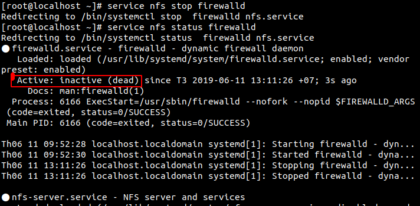
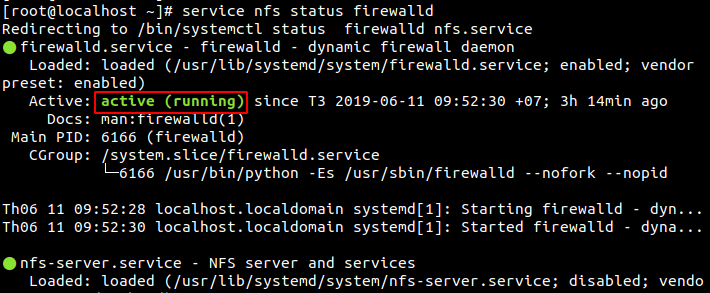

# Network File System - NSF
- Dịch vụ NFS cho phép chia sẻ tập tin cho nhiều người dùng trên cùng mạng và người dùng có thể thao tác như với tập tin trên chính đĩa cứng của mình.  
- Để thực hiện được việc này ta cần ít nhất 2 máy chạy hệ điều hành Linux trong đó có một máy đóng vai trò Server và các máy còn lại là các máy Client.  
## Cài đặt NFS server
Với hệ thống NFS server, chúng ta sẽ sử dụng lệnh sau:
```
yum install nfs-utils nfs-utils-lib​ 
``` 


- NFS sử dụng tập tin /etc/exports để lưu danh sách tập tin hệ thống được chia sẻ và tên máy tính (hoặc địa chỉ IP tương ứng) được cấp quyền sử dụng.   
- Tập tin /etc/exports có cấu trúc như sau:  
</tên_thư_mục_chia_sẻ> <Tên_máy_tính_hoặc_địa_chỉ_IP><(quyền hạn)>​  

- Trong đó các tham số được hiểu như sau:   

+Tên_thư_mục_chia_sẻ là tên thư mục cần chia sẻ cho máy trạm.  
+Tên_máy_tính_hoặc_địa_chỉ_IP là tên máy được chia sẻ hoặc địa chỉ IP tương ứng. Nếu bạn dùng địa chỉ IP thì có thể liệt kê nhiều máy theo địa chỉ mạng con.  
+Quyền hạn: các máy trạm có thể có các quyền hạn sau:  

• rw: quyền đọc và viết.  
• ro: quyền chỉ đọc.  
• noaccess: cấm truy cập vào các thư mục cấp con của thư mục được chia sẻ.​  
- Ở đây tôi sẽ thực hiện chia sẻ thư mục data cho các máy client. IP_client có thể là địa chỉ của cả một mạng có thể chỉ là địa chỉ của máy cụ thể. Ở ví dụ này tôi chỉ chia sẻ với máy cụ thể có địa chỉ là 192.168.184.129/24    
Đầu tiên, ta tạo 1 thư mục có tên data :



Dùng lệnh  vi /etc/exports để mở file. Mỗi lần sửa file này xong ta cần dùng lệnh exportfs -a thì thay đổi mới được cập nhật.

  

Sau khi sửa đổi tập tin cấu hình /etc/exports, NFS không thể hiểu ngay sự thay đổi này. Do đó bạn phải khởi động lại dịch vụ bằng câu lệnh:

```
service nfs start
```



Ngược lại khi muốn dịch vụ ngừng hoạt động, bạn có thể dùng một trong hai câu lệnh dưới đây:

```
service nfs stop​ firewalld
```

Để kiểm tra trạng thái hoạt động của dịch vụ NFS trên server của mình để biết rằng dịch vụ này hiện đang hoạt động hay đã ngừng.
```
service nfs status​ firewalld
```



