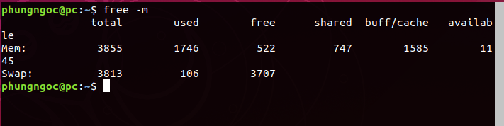
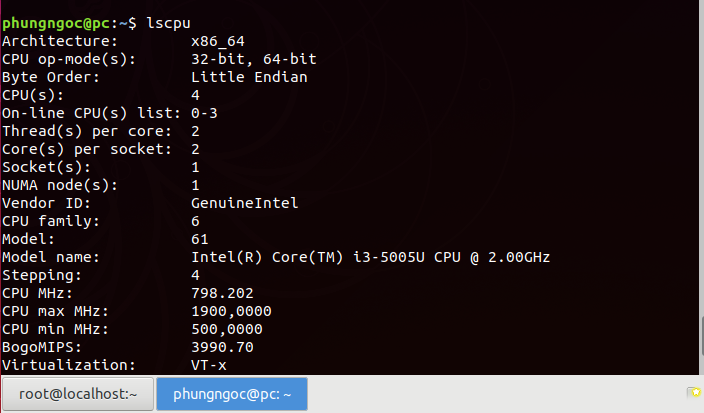
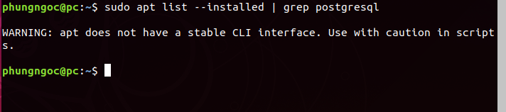
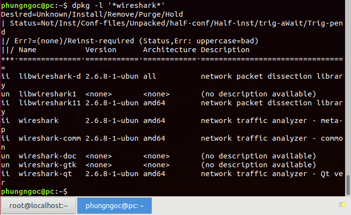

# Linux commands 
## 1. echo
- Lệnh echo dùng để hiển thị nội dung văn bản, thay thế, thêm nội dung trong file.
- Cú pháp :  
```
echo [option] [string]
```
 Các opition :  
- -e ở đây cho phép giải thích các dấu gạch chéo ngược:  
1. \b : xóa tất cả các khoảng trắng ở giữa văn bản
2. \n: tùy chọn này tạo ra dòng mới
3. \t: tùy chọn này được sử dụng để tạo không gian tab ngang.  
- echo * : lệnh này sẽ in tất cả các tệp / thư mục, tương tự như lệnh ls.   

| Lệnh |	Chức năng |  
| ------ | ------ |  
| echo "string" > newfile |	Dùng để thêm một chuổi vào một tệp mới |
| echo "string" >> newfile | Dùng để nối một chuổi vào cuối tệp đã tồn tại |
| echo $VARIABLE | Dùng để hiển thị nội dung biến môi trường |

- Lệnh echo hổ trợ in kết quả được tô màu:  
Đối với chuỗi ký tự, có các mã màu được sử dụng phổ biến sau:  

   reset – 0  
   black – 30  
red – 31   
green – 32  
yellow – 33  
blue – 34  
magenta – 35  
cyan – 36  
white – 37  

Để in ra 1 đoạn văn bản được tô màu, dùng lệnh sau:
```
echo -e "\e[Mamau doanvanban \e[0m"
```
Trong đó"

\e[Mamau => là chuỗi escape thiết lập màu.  
\e[0m => reset lại màu mặc định  

## 2. cp 
- cp là một lệnh Linux để sao chép các tập tin và thư mục.
- Cú pháp :
```
cp [option] source dest
```  
- Tạo ra bản sao của file:
```
cp (file(file)).backup
```
- Copy file1 thành file2
```
cp (file1) (file2)
```
- Copy thư mục và file trong đó thành thư mục khác: 
``` 
cp -r <directory1> <directory2>/
``` 
## 3. chown
- Lệnh chown được sử dụng để thay đổi quyền sở hữu của người dùng và nhóm của một tệp, thư mục hoặc liên kết đã cho.
- Cú pháp:  
``` 
chown [option] user[:group] file(s)
```
## 4. Kiểm tra RAM, CPU (central prossesing unit)
- Để xem lượng RAM đã sử dụng chúng ta có rất nhiều lệnh khác nhau như:
```
free -m
```
ví dụ :



- Để hiển thị thông tin CPU ta dùng lệnh sau :

```
lscpu
```
- In ra thông tin của CPU :
```
cat /proc/cpuinfo
```
+
ví dụ :



## 5. Cách kiểm tra các packet đã được cài đặt 
- Sử dụng lệnh apt như sau:  
```
apt list --installed | grep <package_name>
```
Ví dụ :



- Nếu muốn kiểm tra những ứng dụng nào đã cài đặt, chúng ta sẽ sử dụng dpkg:  
```
sudo dpkg –list
```
- Duyệt toàn bộ danh sách bằng lệnh:

```
sudo dpkg –list | less
```
- Tìm kiếm bằng tham số grep đi kèm:
```
dpkg –list | grep [search term]
```
 Ví dụ :

 

## 6. Liệt kê user

- Để liệt kê danh sách các user chúng ta có thể dùng câu lệnh sau:
```
$ cat /etc/passwd
```

- Để chỉ hiển thị tên của người dùng chúng ta có thể dùng câu lệnh sau:
```
$ cut -d : -f 1 /etc/passwd
```

- Ngoài ra, chúng ta cũng có thể sử dụng chương trình awk thay vì cut để lấy ra danh sách người dùng trên hệ thống như sau:

```
$ awk -F':' '{ print $1}' /etc/passwd
```
## 7. Cài đặt phần mềm 
### 7.1. Cài đặt online
- Mở Terminal: Ctrl Alt T 
- Ta dùng lệnh :
```
sudo apt-get install ten_goi
```

- Nhập mật khẩu và đợi cài đặt xong
### 7.2. Cài đặt offline
- Các gói phần mềm thường có đuôi là: .deb, .rpm, .bin và dạng nén tarball (.tar, .tar.gz, .tgz,…)  
- Cài đặt file .deb  
 Ta chỉ cần click vào là tự nó sẽ cài đặt – sử dụng Ubuntu Software Center.  
- 