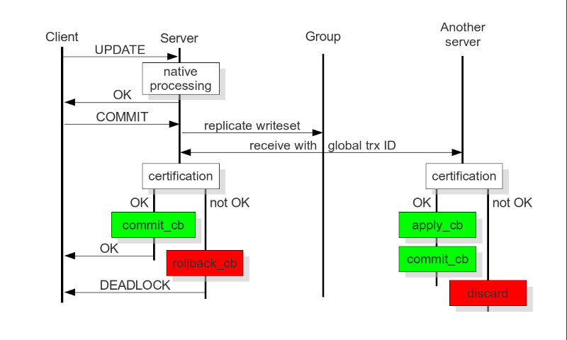
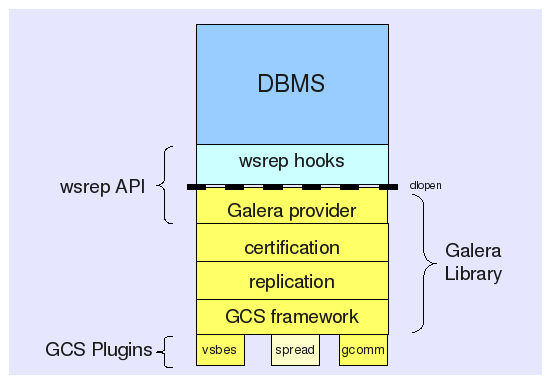

# MariaDB replication Galera CLuster

# Mục lục
[1. Giới thiệu](#1)    
[2. Replicator Architecture](#2)  
[3. Cách thức hoạt động](#3)    
[4. Ưu nhược điểm](#4)    
[5. Phiên bản Galera ](#5)   
[6. Phương thức đồng bộ](#6)   


<a name="1"></a>

## 1. Giới thiệu



Galera Cluster là giải pháp tăng tính sẵn sàng cho cách Database bằng các phân phối các thay đổi máy chủ trong Cluster.Trong trường hợp một máy chủ bị lỗi thì các máy chủ khác vẫn sẵn sàng hoạt động phục vụ các yêu cầu từ phía người dùng.

<a name="2"></a>

## 2. Replicator Architecture (Kiến trúc)


 

Kiến trúc Galera Cluster bên trong gồm 4 phần :
- `DBMS` (Database Management System - Hệ quản trị CSDL) : MariaDB Server
- `wsrep API`: Đây là giao diện cho máy chủ cơ sở dữ liệu và nó cung cấp dịch vụ sao chép. Nó bao gồm hai yếu tố chính: 

   - `wsrep hooks` : tích hợp với công cụ database server phục vụ nhân bản write-set.
   - `dlopen` : Hàm này làm cho nhà cung cấp wsrep có sẵn cho các wsrep hooks.

- `Galera provider` : triển khai wsrep API cho thư viện Galera để cung cấp chức năng nhân bản write-set.
- `certification` : chịu trách nhiệm chuẩn bị tập ghi (write sets) và thực hiện việc chứng nhận.
- `Replication` : quản lý giao thức nhân bản và cung cấp toàn bộ khả năng ordering.
- `GCS framework` : cung cấp kiến trúc plugin cho các hệ thống giao tiếp nhóm. Nhiều cài đặt GCS có thể được thích nghi (adapt), được thử nghiệm với những cài đặt in-house như: vsbes và gemini.

<a name="3"></a>

## 3. Cách thức hoạt động

  


Bản thân các database như mariadb, percona xtradb không có tính năng multi master được tích hợp sẵn bên trong. Các database này sẽ sử dụng một galera replication plugin để sử dụng tính năng multi master do galera cluster cung cấp. Về bản chất, galera replication plugin sử dụng một phiên bản mở rộng của mysql replication api, bản mở rộng này có tên là wsrep api.

Dùng wsrep api, galera cluster sẽ thực hiện được certification based replication, một kỹ thuật cho phép thực hiện multi master trên nhiều node. Một `writeset` , chính là một transaction cần được replication trên các node. Transaction này sẽ được `certificate` trên từng node nhận được (qua replication) xem có `conflict` với bất cứ transaction nào đang có trong queue của node đó không. Nếu có thì replicated writeset này sẽ bị node `discard` . Nếu không thì replicated `writeset` này sẽ được `applied`. 
Kiểm tra chứng nhận được dựa trên `Global Ordering`(đặt hàng toàn cầu) của các transaction,theo đó mỗi transaction sẽ được gán `1 global transaction id - GTID`. Trong suốt thời gian `COMMIT`, transaction cuối được kiểm tra với các transaction trước đó để phát hiện bất kỳ xung đột chính nào và nếu phát hiện có xung đột thì kiểm tra chứng nhận thất bại. Nếu kiểm tra thành công, tất cả các node sẽ nhận được transaction với cùng một thứ tự `Global`.   

API wsrep sử dụng ID giao dịch toàn cầu - GTID. 
Điều này cho phép nó xác định các thay đổi trạng thái và xác định trạng thái hiện tại liên quan đến thay đổi trạng thái cuối cùng. 
```
GTID = State_UUID : Ordinal_Sequence_Number
```
- `source_id` : Đây là mã định danh duy nhất cho trạng thái và chuỗi các thay đổi mà nó trải qua.
- `Ordinal_Sequence_Number` : số thứ tự được xác định theo thứ tự giao dịch được thực hiện trên server này.  
Ví dụ :
    ```
    3E11FA47-71CA-11E1-9E33-C80AA9429562:23
    ```
GTID cho phép bạn so sánh trạng thái ứng dụng và thiết lập thứ tự thay đổi trạng thái. Bạn có thể sử dụng nó để xác định xem có thay đổi được áp dụng hay không và liệu thay đổi đó có áp dụng cho một trạng thái nhất định hay không.

<a name="3"></a>

## 3. Ưu nhược điểm

### Ưu điểm 
- Cho phép read/write trên node bất kỳ.
- Synchronous replication.
- Multi thread slave cho phép apply writeset nhanh hơn
- Không cần failover vì node nào cũng là master rồi.
- Automatic node provisioning: Bản thân hệ database đã tự backup cho nhau. Tuy nhiên, khả năng backup tự nhiên của galera cluster không loại trừ được các sự cố do con người gây ra như xóa nhầm data.
- Hỗ trợ innodb.
- Hoàn toàn trong suốt với application nên application không cần sửa đổi gì
- Không có Single point of failure vì bất cứ node nào trong hệ cluster cũng là master.

### Nhược điểm

- Không hỗ trợ MyISAM, chuyển đổi một database sử dụng các myisam table sang innodb để sử dụng galera cluster sẽ khó khăn.
- Vẫn có hiện tượng stale data do bất đồng bộ khi apply writeset trên các node.

<a name="5"></a>

## 5. Phiên bản Galera

<a name="6"></a>

## 6. Phương thức đồng bộ

Galera sử dụng 3 phương thức để đồng bộ dữ liệu: mysqldump, rsync và xtrabackup-v2

- `rsync` là phương thức mặc định và yêu cầu ít thời gian setup nhất. Điểm yếu của nó là node đầu mối (donor node) sẽ bị block với tất cả các hoạt động trong lúc đang thực hiện SST.

- `mysqldump` chuyển dữ liệu dưới dạng các lệnh SQL INSERT. Mỗi lệnh này sẽ tốn thời gian để thực thi trên các node đang join vào nếu kích thước của tập dữ liệu là đáng kể. Có một vài kỹ thuật để tăng hiệu suất insert, tuy nhiên nó không thể loại bỏ cản trở lớn nhất là dữ liệu được chuyển theo kiểu row-by-row thay vì file-by-file.

- `xtrabackup-v2` sử dụng công cụ Percona XtraBackup để thu về một snapshot không bị block (non-blocking snapshot) của node đầu mối (donor node) và sau đó sử dụng snapshot đó để khởi động node mới join vào. Điều này yêu cầu cài đặt phức tạp hơn một chút, nhưng node đầu mối hầu như luôn sẵn sàng cho việc query trong suốt quá trình xử lý. Đây là phương thức nên sử dụng để cài đặt nếu muốn loại bỏ thời gian chết của node đầu mối.

Galera sử dụng các cổng sau:

- Cổng 3306 để kết nối với MySQL client và State Snapshot Transfer (SST) nếu sử dụng phương thức mysqldump để đồng bộ

- Cổng 4567 dùng cho replication traffic, multicast. Sử dụng cả 2 giao thức UDP và TCP

- Cổng 4568 dùng cho Incremental State Transfer(IST)

- Cổng 4444 dùng cho State Snapshot Transfer nếu sử dụng phương thức rsync để đồng bộ

