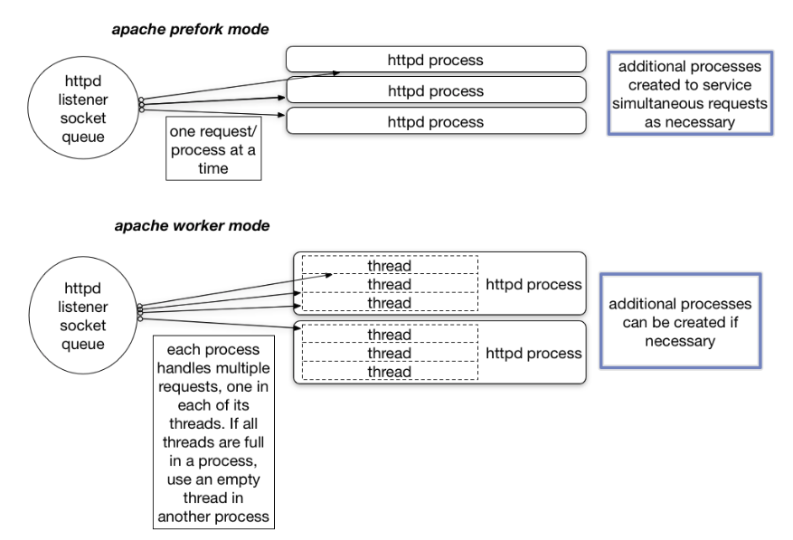

# Apache MPM prefork, MPM worker
## MPM prefork
- Đây là MPM mặc định khi bạn cài đặt Apache,Các tiến trình con của Apache được chạy (process), thì trong mỗi tiến trình đó chỉ có một luồng (thread) chạy để lắng nghe các yêu cầu kết nối gửi đến, cũng như xử lý các kết nối đó.
- Mỗi yêu cầu được xử lý trên một tiến trình riêng - độc lập,mà Apache trên server cần nhiều tài nguyên hơn các MPM khác.
## MPM worker
- MPM worker mỗi process có thể chạy nhiều thread (đa luồng), mỗi luồng đó lắng nghe yêu cầu, xử lý yêu cầu ... Do đó mà MPM worker xử lý cùng lúc được nhiều yêu cầu hơn MPM prefork thi cùng dùng một lượng tài nguyên.  

Cơ chế hoạt động của mpm prefork và mpm worker:

 

Ưu nhược điểm của prefork :
- Ưu điểm: Các process được xử lý hoàn toàn một cách độc lập, cho nên nếu một process chế thif các process còn lại vẫn sống và vẫn hoàn thành công việc của nó.  
- Nhược điểm: Có vẻ nhược điểm lớn nhất chính là việc tạo ra quá nhiều các process sẽ chiếm dung lượng RAM lớn.  

Ưu nhược điểm của worker :
- Ưu điểm: Tận dụng được dung lượng bộ nhớ RAM, vì các thread sẽ sử dụng chung bộ nhớ RAM.
- Nhược điểm: Nếu có một thread có vấn đề hoặc bị crash thì các thread khác trong process bị crash theo.Sử dụng chung vùng nhớ nên có thể gây ảnh hưởng lẫn nhau.
